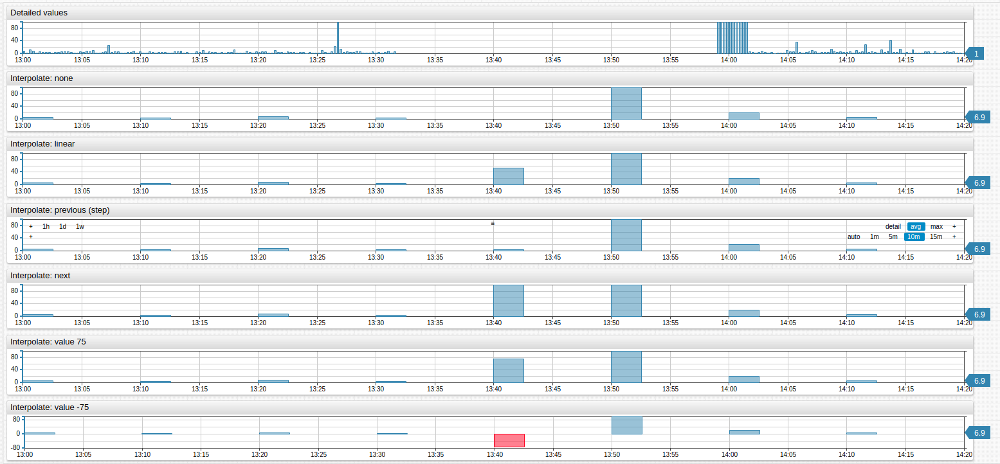
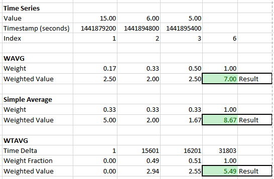
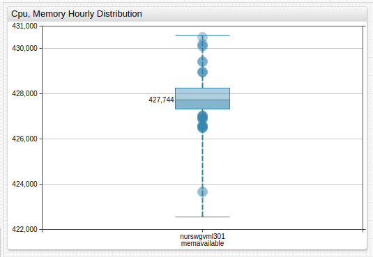
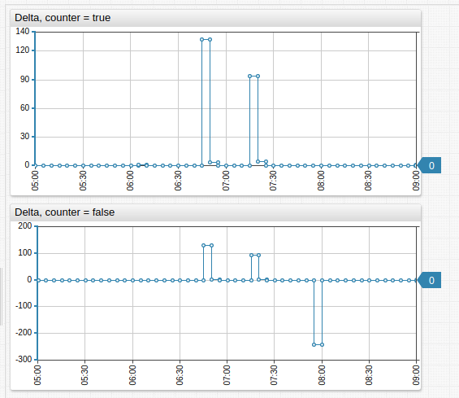
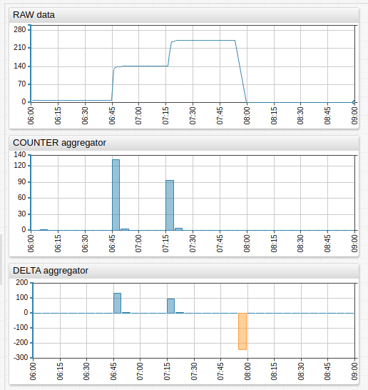

# Aggregation Functions

Statistical functions are applied to values in each period to calculate period statistics.

<!-- markdownlint-disable MD101 -->

## Server and Client Aggregators

Calculated on client side if `server-aggregate=false`, otherwise in ATSD.

Syntax | Description
--- |--- |
[`count`](#count) | **Number** of samples during the period. |
[`min`](#min) | **Minimum value** during the period. |
[`max`](#max) | **Maximum value** during the period. |
[`sum`](#sum) | **Sum** of values during the period. |
[`avg`](#avg) | **Average value** during the period. |
[`percentile(n)`](#percentile)| `n`-th [percentile](https://axibase.com/docs/atsd/api/data/aggregation.html#percentile), for example `PERCENTILE(75)` or `PERCENTILE(99.5)`. `n` is a decimal number between `[0, 100]`.|
[`median`](#median) | Median value, same as 50% percentile. |
[`first`](#first) | **First** value received during the period. |
[`last`](#last) | **Last** value received during the period. |
[`delta`](#delta) | **Delta** is the difference between the last value in the period and the last value in the previous period. If no last value is present in the previous period (empty period), then `delta` is the difference between the last and first values during the current period. See also [`counter`](#counter) aggregator. |
[`counter`](#counter) | Sum of the differences between consecutive values in the period. If the difference between any two values is negative, the difference is replaced with the value itself. If the difference between values is always non-negative, the `counter` aggregator returns the same value as the `delta` aggregator. Refer to this [**Example**](https://apps.axibase.com/chartlab/86c6b6e0) to better understand the difference between `COUNTER` and `DELTA`. |

## Server Aggregators

Force `server-aggregate=true`, calculated in ATSD.

Syntax | Description
--- |--- 
[`standard_deviation`](#standard_deviation) | **Standard deviation** of values during the period. √ of the variance. |
[`median_abs_dev`](#median_abs_dev) | **Median absolute deviation** of values during the period. `median(abs(value - median(value)))`. |
[`wtavg`](#wtavg) | An **average** created via the multiplication of each component by a factor reflecting importance. Weight is assigned **based on timestamps** rather than index. Data points with older timestamps contribute less to the weighted mean than more recent data. The weight of a sample is proportional to the `current_time – first_time + 1` (in seconds), where `current_time` is the timestamp of the sample, and `first_time` is the timestamp of the first sample received during the period. Weights are normalized, their sum is equal to `1`. Refer to the [calculation example](#avg-wavg-and-wtavg-example) below. |
[`wavg`](#wavg) | A **weighted average** of samples received during the period. The weight of a sample is proportional to the index of the sample in the time-ordered array of all samples during the period. Weights are normalized, their sum is equal to `1`. A weighted average is sum of sample values multiplied by weight. Refer to the [**Calculation Example**](#avg-wavg-and-wtavg-example) below. |
[`min_value_time`](#min-value-time) | **Time** when the minimum value ([`min`](#min)) occurred for the first time during the period. |
[`max_value_time`](#max-value-time) | **Time** when the maximum value ([`max`](#max)) occurred for the first time during the period. |
[`threshold_count`](#threshold-count) | Number of **threshold violations** during the period. A violation is a sequence of one or more successive data points exceeding the specified threshold. **Example**: The following values are collected every `5` minutes. `1, 2, 5, 7, 1, 1`.  If the threshold is set to `4`, then one sequence (`5`,`7`) exceeds the threshold. |
[`threshold_duration`](#threshold-duration) | **Total duration** of threshold violations during the period in **milliseconds**. A violation is a sequence of one or more successive data points exceeding the specified threshold. **Example**: The following values are collected every `5` minutes. `1, 2, 5, 7, 1, 1`. If the threshold is set to `4`, then one sequence (`5`,`7`) exceeds the threshold and its total duration based on linear interpolation is `550` seconds. If the threshold is `5`, then duration is `850` seconds. For periods at the beginning of the timespan, at the end of the timespan or after a missing period, the value at the beginning of the period is set to the first value, and the value at the end of the period is set to last value. |
[`threshold-percent`](#threshold-percent) | **Percent** of time during which the value remained below threshold (no violation). Formula: `threshold_percent = 100 - threshold_duration / period_duration * 100` |

<!-- markdownlint-enable MD101 -->

## Interpolation Functions

If the period does not contain any detailed values, they are excluded from the results. The default behavior `NONE` can be modified by specifying an interpolation function to fill missing periods.

|Function |Description |
|--- |--- |
[`NONE`](#none) | No interpolation. Periods without any raw values are excluded from results. |
[`LINEAR`](#linear) | Calculate period value using linear interpolation between previous and next period values. |
[`PREVIOUS`](#previous) | Set value for the period based on the previous period’s value. |
[`NEXT`](#next) | Set value for the period based on the next period’s value. |
[`VALUE`](#value) | Set value for the period to a specific number. |

### Examples

## `AVG`, `WAVG`, and `WTAVG` Example

See the Excel spreadsheet for testing and calculation.

[`wtavg()`](#wtavg): Weighted time average.

Calculation: `Weight = (sample.time - first.time)/(last.time - first.time + 1)`

## Examples

**Box Chart with `percentile`**

**Histogram with `percentile`**

**Time Chart with `delta`**

**Time Chart with `count` and `delta`**

