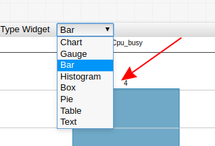
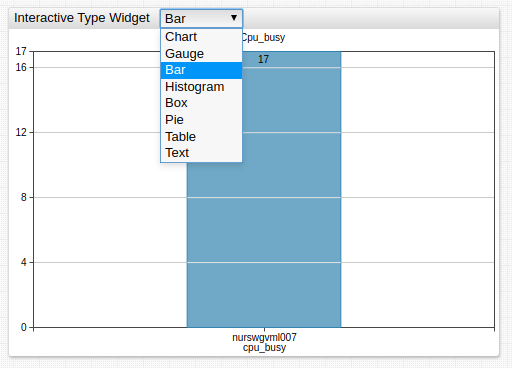
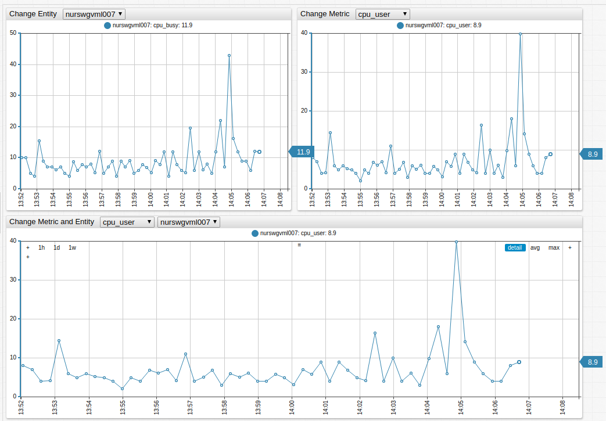
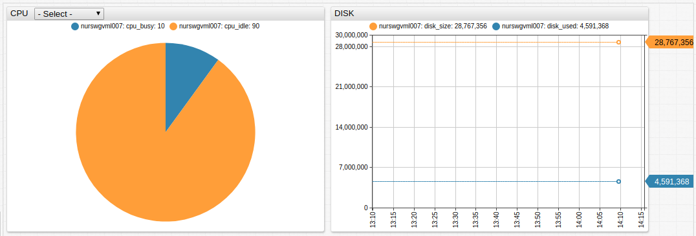

# Drop-down Lists

Drop-down lists provides a way to display interactive options inside a widget header.

Configure the list to update a widget setting for changes made, such as the widget type itself and the metric, entity, or property type.



Add multiple drop-down lists for any widget.

## Drop-down List Configuration

* The settings apply to the `[dropdown]` section.

Name | Description | &nbsp;
--|--|--
<a name="on-change"></a>[`on-change`](#on-change) | If specified, field is evaluated instead of default `onchange` behavior.<br>Either `onchange`, or `change-field` is **required** for any drop-down list.<br>**Example**: `on-change = widget.reload();` | [↗](https://apps.axibase.com/chartlab/f0b0039d)
<a name="change-field"></a>[`change-field`](#change-field) | Widget setting changed upon drop-down list selection.<br>To update the widget subsection setting, use `{section-name}.{setting-name}` syntax.<br>**Example**: `change-field = series.metric` | [↗](https://apps.axibase.com/chartlab/b128e746)
<a name="format"></a>[`format`](#format) | Format applied to the option value if no text setting is specified.<br>**Example**: `format = 'value.toUpperCase()` | [↗](https://apps.axibase.com/chartlab/e50eea0f)
<a name="style"></a>[`style`](#style) | CSS to apply to the selected element.<br>**Example**: `style = color: orange` | [↗](https://apps.axibase.com/chartlab/0e84d2a8)
<a name="options"></a>[`options`](#options) | Comma-separated list of option values.<br>Refer to [Options Syntax](#options-syntax) for possible values.<br>**Example**: `options = jfs, system, network` | [↗](https://apps.axibase.com/chartlab/e9e5c5e0)

### Options Syntax

Comma-separated list:

```ls
options = opt1, opt2, opt3
```

Placeholder to `list` of `var` array:

```ls
options = @{taglist}
```

If the list or array contains elements with a comma, use the `escape()` method to backslash commas:

```ls
options = @{taglist.escape()}
```

`[option]` fields:

```ls
[option]
  text = opt1
[option]
  value = opt2
[option]
  value = opt3
  text = Option 3
```

## Option Configuration

* The settings apply to the `[option]` section

Name | Description | &nbsp;
--|--|--
<a name="value"></a>[`value`](#value) | Drop-down list option value.<br>**Example**: `value = cpu_busy` | [↗](https://apps.axibase.com/chartlab/a995466b)
<a name="text"></a>[`text`](#text) | Drop-down list option text.<br>**Example**: `text = CPU Busy`| [↗](https://apps.axibase.com/chartlab/a995466b)

* If only `text` is specified, `value = text`
* Populate the list of options with the [`options`](#options) setting or as a list of `[option]` fields.

## Examples

### Change Widget Type

```ls
[widget]
  type = bar

/* this drop-down modifies widget type on change
the list of displayed options is specified in options field */
[dropdown]
  options = Chart, Bar, Gauge
  change-field = type

[series]
  metric = cpu_busy
  entity = nurswgvml007
```



[](https://apps.axibase.com/chartlab/d84eedd0)

### Change Property Type

```ls
[dropdown]
  on-change = widget.post.queries[0].type = this.value; widget.reload();
  change-field = property.type
  options = configuration, jfs, system, network  

[property]
  type = configuration
```


[](https://apps.axibase.com/chartlab/d84eedd0)

### Change `Metric`, `Entity`, or Both

```ls
[dropdown]
  change-field = series.metric
  options = cpu_user, cpu_system, cpu_busy
[dropdown]
  change-field = series.entity
  options = nurswgvml007, nurswgvml006
```



[](https://apps.axibase.com/chartlab/382f4302)

### Replace Series

```ls
[dropdown]
  options = nurswgvml007, nurswgvml006, nurswgvml010
  on-change = replaceEntityInSeriesCollection(cpu_series, this.value); cpu_widget.replaceSeries(cpu_series);  replaceEntityInSeriesCollection(disk_series, this.value); disk_widget.replaceSeries(disk_series);
```



[](https://apps.axibase.com/chartlab/3179db2b)