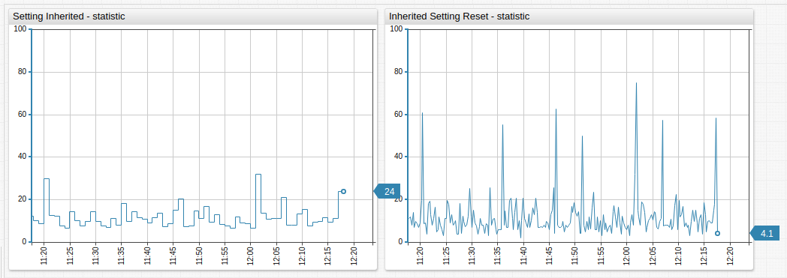
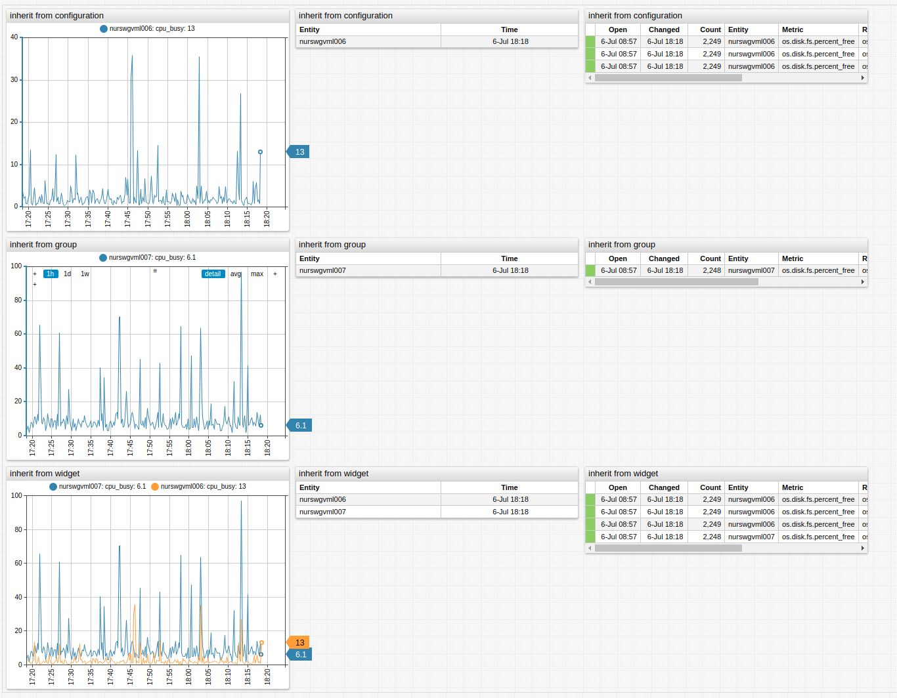

# Inheritance

Specify shared settings at the [`[configuration]`](./README.md) level, or group-specific settings when designing a large portal at the `[group]` level. Overwrite inherited settings at `[widget]` or `[series]` by defining different settings for a widget or series.

If all widgets in a portal are created for the same server, set the `entity` setting at the `[configuration]` level. All included widgets share the same `entity` setting. This makes syntax more compact and easy to replace shared settings.

```ls
[widget]
  type = chart
  
#metric field is inherited by all series in the widget
  metric = nmon.cpu_total.busy%

  [series]
    entity = awsswgvml001
  [series]
    entity = nurswgvml006

#inherited metric is overwritten for this series
    metric = mpstat.cpu_busy%

  [series]
    entity = nurswgvml007
```


[](https://apps.axibase.com/chartlab/3230deb6/2/)

In this example, the same metric is inherited by all series in the widget because the metric is defined at the `[widget]` level however the second series overrides the inherited value with the `metric = mpstat.cpu_busy%` setting.

## Resetting Inheritance

To override or reset an inherited setting to the default value, specify the name of the setting as an empty string:

```ls
statistic =
```

If a setting needs to be set to whitespace or empty string, specify the value of the setting in double quotes:

```ls
statistic = ""
```



[](https://apps.axibase.com/chartlab/061b5af1)

## Portal Example



[](https://apps.axibase.com/chartlab/f137e7d8)