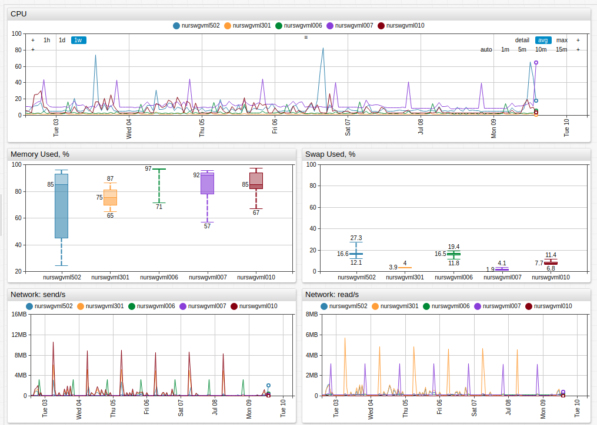
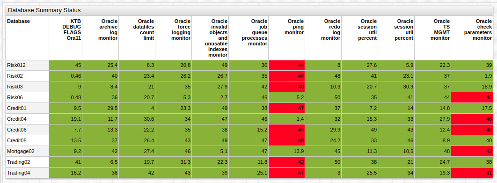

# Summary Portals

Use a combination of inheritance and control structures, in particular `for` and `endfor`, to build multi-server portals with minimal configuration.



[](https://apps.axibase.com/chartlab/3230deb6/1)

```ls
list servers = awsswgvml001, nurswgvml003, nurswgvml009
[widget]
    type = chart
    metric = nmon.cpu_total.busy%
    for server in servers
[series]
   entity = @{server}
   endfor
```

When the list includes elements with multiple fields, such as hostname, IP address, location, or function, use the `var` array instead of `list` to print out field values as tooltips or properties.


[](https://apps.axibase.com/chartlab/3230deb6/3/)

This example displays how a `var` array incorporates server properties displayed in legend tooltip on mouseover.

As an alternative to specifying list elements manually, lists can be retrieved from the server using Freemarker expressions.

`getResourcesForGroup(group_id, [list of product codes])`:

Return the list of agents collecting data. If the group contains hosts with agents, they are traversed to the agent level to return the list of agents. For example, if the groups contains hosts `ABC` (ITM Linux) and `CDE.axibase.com` (SCOM), the method returns agent identifiers: `abc:LX` and `Microsoft.Window.Computer:CDE.axibase.com`.

```ls
list resources = ${getResourcesForGroup("linux")?join(",")}
list resources = ${getResourcesForGroup("windows_server_2008")?join(",")}
```

`getHostsForGroup(group_id [, list of product codes])`:

Return list of hosts. If the group contains agents, they are traversed up the tree to return hosts.

```ls
list hosts = ${getHostsForGroup("scom-itm_group", "LZ")?join(",")}
```

If the group contains agents with different product codes, address specifics using a `if` or `endif` condition based on the agent name, or the method can executed multiple times by filtering the group by different product codes.

```ls
[widget]
  type = chart
  title = Memory Usage for Linux and Windows Servers
  #retrieve SCOM agents first
  list resources = ${getResourcesForGroup("scom-itm_group", "01")?join(",")}
  for rsc in resources
    [series]
      table = Microsoft.Windows.Server.2008.Monitoring_Memory
      attribute = % Committed Bytes In Use
      entity = @{rsc}
  endfor
  #retrieve Linux agents second
  list resources = ${getResourcesForGroup("scom-itm_group", "LZ")?join(",")}
  for rsc in resources
    [series]
      table = KLZ_VM_Stats
      attribute = Memory_Used_Pct
      entity = @{rsc}
endfor
```

The Table widget is the most compact method of displaying many metrics together.



[](https://apps.axibase.com/chartlab/bb65c060)