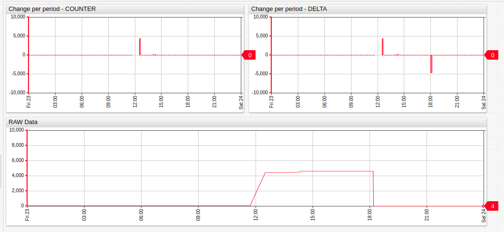

# Extended Aggregators

## `min_value_time`

Computes the time when the minimum is reached for the first time in a period.

```ls
statistic = max_value_time
```

## `max_value_time`

Computes the time when the maximum is reached for the first time in a period.

```ls
statistic = min_value_time
```


[](https://apps.axibase.com/chartlab/37cbde3d/8/)

> Example includes `min_value_time` and `max_value_time` aggregators.

## `delta`

Computes the difference between the first and last values within a period. If there are multiple adjacent periods, the function computes delta as the difference between the last values of adjacent periods.

```ls
statistic = delta
```

## `counter`

Similar to delta except for special processing of resets. Applicable for incrementing non-negative metrics. Reset occurs when the series value is lower than the previous value, in which case the counter adds the difference between 0 and the current value.

```ls
statistic = counter
```



[](https://apps.axibase.com/chartlab/021e9dca)

> Example includes `counter` and `delta` aggregators.