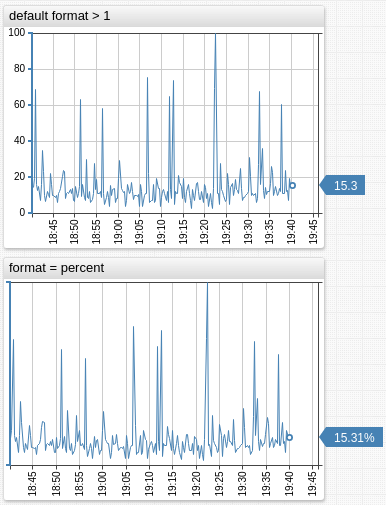
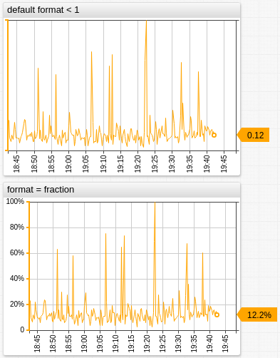
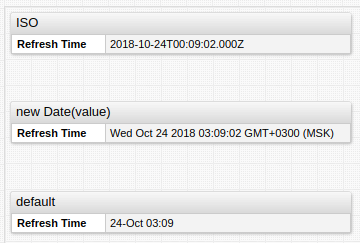

# Format Settings

## Basic Formats

The `format` setting supports the following functions.

Name | Description | &nbsp;
:--|:--|:--
<a name="decimal-numeric"></a>[`decimal`](#decimal-numeric)| Format numbers with up to specified number of fractional digits.<br>`numeric` is an alias for `decimal`.<br>**Example**: <br>`format = numeric(2) // 3.10 > 3.1`| [↗](https://apps.axibase.com/chartlab/160d5c94)
<a name="fixed"></a>[`fixed`](#fixed)| Format numbers with the specified number of fractional digits.<br>**Example**: <br>`format = fixed(2) // 1.5 > 1.50`| [↗](https://apps.axibase.com/chartlab/c0ae0118)
<a name="currency"></a>[`currency`](#currency) | Currency formatting.<br>Indicate units as an argument in the `currency` expression.<br>Decimal values rounded to 1 fractional digit.**Example**: <br>`format = '$' + currency('million') // 6.3 > $6.3M`.| [↗](https://apps.axibase.com/chartlab/a36fc97a)
<a name="precise"></a>[`precise`](#precise)| Formats a number to a specific precision.<br>Refer to [`Number.prototype.toPrecision()`](https://developer.mozilla.org/en-US/docs/Web/JavaScript/Reference/Global_Objects/Number/toPrecision).<br>**Example**: `format = precise(5)`| [↗](https://apps.axibase.com/chartlab/1339f722)

## `fixed`

Controls the number of displayed fractional digits. The input value is not rounded. The value to be formatted is optional and can be specified an arithmetic expression. By the default the input value is set to value of the sample at the given timestamp.

```javascript
fixed([number value, ] integer digits)
```

### Syntax

```javascript
fixed(value, 3);        // 3.14159 -> 3.141
fixed(3);               // 3.14159 -> 3.141
fixed(2);               // 3.14159 -> 3.14
fixed(1);               // 3.14159 -> 3.1
fixed(0);               // 3.14159 -> 3
fixed(0);               // 12345.6 -> 12345
fixed(3.14159, 3);      // 3.14159 -> 3.141
fixed(value*2, 3);      // 3.14159 -> 6.2
```

## Rounding

Perform rounding on displayed values:

```javascript
round([value, ] digits)
```

```ls
format = round(0)
format = round(value/512, 1)
format = round(-3)
```

* If `number_of_digits > 0`, the value is rounded to the specified number of decimal places.
* If `number_of_digits = 0`, the value is rounded to the nearest integer.
* If `number_of_digits < 0`, the value is rounded to the left of the decimal point.

Operation | Syntax
--|--
`12.34` rounded to `12.3` | `format = round(1)`
`12.34` rounded to `12` | `format = round(0)`
`12.34` rounded to `10` | `format = round(-1)`


[](https://apps.axibase.com/chartlab/aebb480d)

## Percentages

Format values as a percentage of `100`.

```ls
format = percent([digits])
```


[](https://apps.axibase.com/chartlab/6775b839#fullscreen)

Decimal Values | Fractional Values
--|--
Formatted as a percentage of `100` | Multiplied by `100` and converted into percentage |
`format = percent(1)` formats `10.23` as `10.2%`. | `format = fraction(2)` formats `0.2324` as `23.24%`
[](https://apps.axibase.com/chartlab/64a714fa) | [](https://apps.axibase.com/chartlab/7a677440)

## Dates

Syntax | Description
---|---
`format = iso` | [ISO format](https://axibase.com/docs/atsd/shared/date-format.html).
`format = new Date(value)` | Print time in current locale.
`format = (new Date(value)).toISOString` | Print current locale time in ISO format.



[](https://apps.axibase.com/chartlab/d1bb8335)

## Intervals

Format series values with millisecond timestamps using the `intervalFormat` function or the `interval-format` setting.

```ls
/* call intervalFormat function */
format = intervalFormat('%dd %H:%M:%S')(value*1000)

/* apply the default format */
interval-format = true

/* apply custom format */
interval-format = %H:%M
```

```txt
2019-04-05T16:01:33Z   -    %H:%M:%S    -    16:01:33
2019-04-05T16:01:33Z   -    %H:%M       -    16:01
```

### Supported Placeholders

* `%d`: Day
* `%H` and `%h`: Hour
* `%M` and `%m`: Minute
* `%S` and `%s`: Second
* `%L` and `%l`: Millisecond

## Examples

### [Table](../widgets/property-table/README.md)


[](https://apps.axibase.com/chartlab/f3137fe9)

### [Bar Chart](../widgets/bar-chart/README.md)


[](https://apps.axibase.com/chartlab/293c46cf/2/)

### [Time Chart](../widgets/time-chart/README.md)


[](https://apps.axibase.com/chartlab/293c46cf/)

## Day Format

The date format controls how time is displayed on the X-axis as well as in sample tooltips.

The date format consists of two settings: `day-format` and `hour-format`.

The `day-format` setting controls the date part of the labels displayed on the time axis.

### Syntax

Common patterns:

* `%d`: Zero-padded day of the month `[01,31]`.
* `%m`: Month number `[01,12]`.
* `%b`: Abbreviated month name.
* `%y`: Year without century `[00,99]`.
* `%Y`: Year with century.
* `%a`: Three-letter abbreviated day name: `Sun`, `Mon`, `Tue`, `Wed`, `Thu`, `Fri`, `Sat`.

Additional patterns:

* `%aa`: Two-letter abbreviated day name: `Su`, `Mo`, `Tu`, `We`, `Th`, `Fr`, `Sa`.
* `%A`: Full day name.
* `%B`: Full month name.
* `%e`: Space-padded day of the month as a decimal number `[ 1,31]`. Equivalent to `%_d`.
* `%j`: Day of the year as a decimal number `[001,366]`.
* `%U`: Week number of the year as a decimal number `[00,53]`. Sunday is the first day of the week.
* `%w`: Weekday as a decimal number `[0(Sunday),6]`.
* `%W`: Week number of the year as a decimal number `[00,53]`. Monday is the first day of the week.

The pattern can include other characters, for example line break `\n` to conserve horizontal space by placing date units on separate lines.

> Related setting to control the number of ticks on the time axis: [`ticks-time`](../widgets/time-chart/README.md#ticks-time).

#### Examples

* Input date is 2019-03-11 (Monday).

```ls
day-format = %m/%d       # -> 03/11
day-format = %y/%m/%d    # -> 19/03/11
day-format = %Y/%m/%d    # -> 2019/03/11
day-format = %b-%d       # -> Mar-11
day-format = %d\n%aa     # -> 11 Mo (placed on separate lines)
```


[](https://apps.axibase.com/chartlab/d0bfcdf8)

## Hour Format

Control the time format for the `x` axis for hour and minute.

### Syntax

Use any combination of the following:

* `%H`: 24-hour time hour as a decimal number `[00,23]`.
* `%I`: 12-hour time hour as a decimal number `[01,12]`.
* `%M`: Minute as a decimal number `[00,59]`.
* `%p`: AM or PM.
* `%X`: time, as `%H:%M:%S`.

> Line break syntax `/n` is supported.

#### Example

```ls
hour-format = %I %p
hour-format = %H:%M
```


[](https://apps.axibase.com/chartlab/6bd3c4a6)

## Measurement Units

```ls
format = bytes
format = kilobytes
format = megawatt
format = kilowatthour
format = hertz
format = kilojoule
format = million watt
format = thousands
```

All functions have two optional arguments:

* **Dimension**: Set to `kilo|thousand`, `mega|million`, `giga|billion`, etc.
* **Digits**: Maximum number of digits after decimal point.