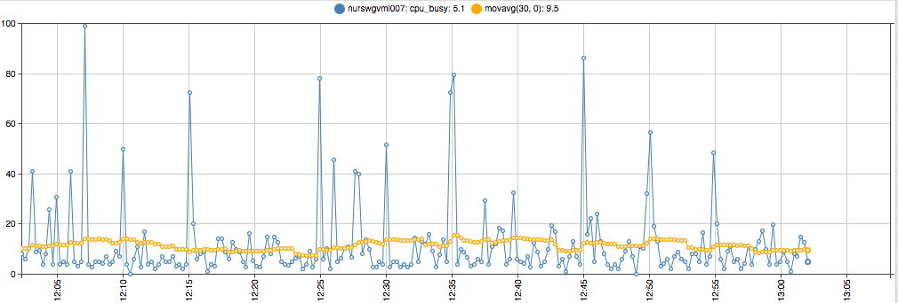
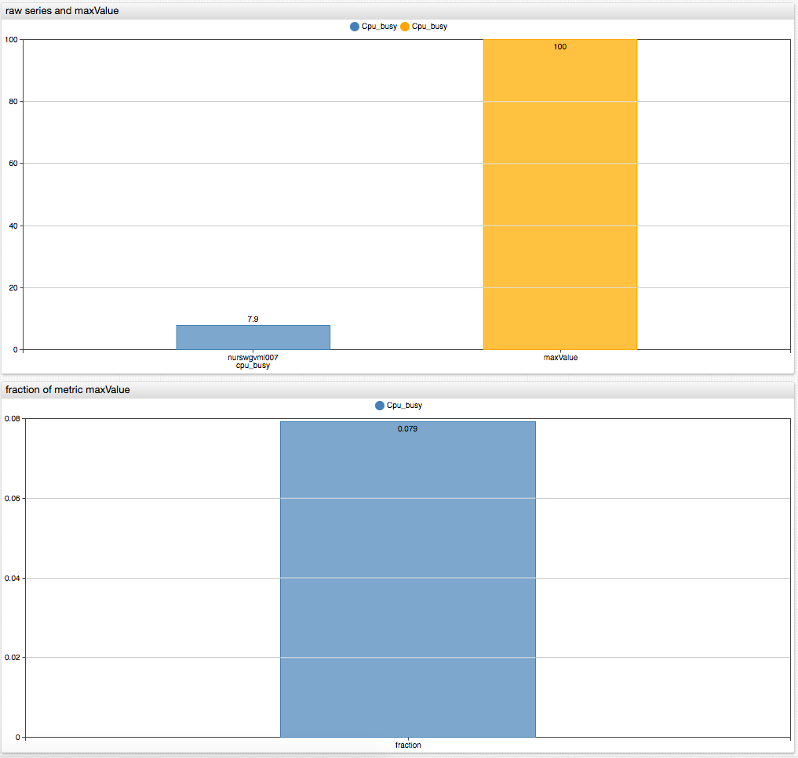
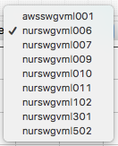
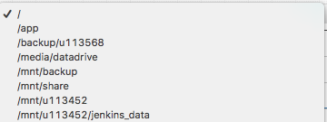
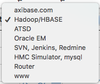
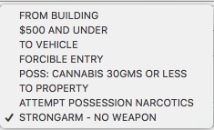
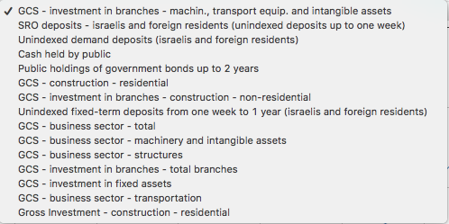

# <a name=header></a> Functions
This page contains descriptions of recently implemented functions.

## Overview


| Name | Description |
|------|-------------|
| [getTags()](#getTags) | Retrieves series for the metric and returns a sorted array of unique values of defined tag |
| [getSeries()](#getSeries) | Returns an array of series collected for the defined metric |
| [getMetrics()](#getMetrics) | Returns names of metrics collected for the defined entity |
| [getEntities()](#getEntities) | Returns names of entities contained in the defined entity-group |
| [range()](#range) | Returns a regularly-spaced array of numbers |
| [csv name = ...](#csv_inline) | Parses CSV-like text into an array of objects |
| [csv name from ...](#csv_from)| Loads a CSV file located at the defined url and parses it into an array of objects |
| [csv.values()](#csv_values) | Retrieves the sorted, unique values of the definied column |
| [list.escape()](#list_escape) | Escapes commas in every element of the array |
| [previous()](#previous) | Retrieves the value of the previous point in a sequence |
| [movavg()](#movavg) | Computes the moving average for some number of previous points |
| [meta()](#meta) | Retrieves metadata object for the series |
| [entityTag()](#entityTag) | Returns the value of the entity tag from metadata object for the series |
| [metricTag()](#metricTag) | Returns the value of the metric tag from metadata object for the series |
| [requestMetricsSeriesValues()](#requestMetricsSeriesValues) | Creates dropdown's options where values are retrieved from the defined field of the series |
| [requestEntitiesMetricsValues()](#requestEntitiesMetricsValues) | Creates dropdown's options where values are retrieved from the defined field of the metric |
| [requestPropertiesValues()](#requestPropertiesValues) | Creates dropdown's options where values are retrieved from the defined field of the entity tags or the property |
| [requestMetricsSeriesOptions()](#requestMetricsSeriesOptions) | Creates dropdown's options where values are retrieved from the defined field of the series |
| [requestEntitiesMetricsOptions()](#requestEntitiesMetricsOptions) | Creates dropdown's options where values are retrieved from the defined field of the metric |
| [requestPropertiesOptions()](#requestPropertiesOptions) | Creates dropdown's options where values are retrieved from the defined field of the entity tags or the property |


<!-- ************************************ getTags() ************************************ -->


## [⇧](#header) <a name="getTags"></a> getTags()

### Description
From the `url` loads series for the `metric` and the `entity`, which last data point has been added after the `minInsertDate` and before the `maxInsertDate`.
Additional `queryParameters` can be specified.
Then unique values of the tag with name `tagName` are retrieved from the tags of the loaded series and sorted.
The returned array includes the `list.escape()` function, which escapes any commas in each element.

### Syntax
```
getTags(metric, tagName, [entity, [minInsertDate, [maxInsertDate, [url, [queryParameters]]]]])
```

### Scope of usage
Can be used in `preprocessor` scope in `var`, `if`, `if else`, `for .. in`, `@{}` expressions.

### API Request
Sends _synchronous_ GET request to the
[/api/v1/metrics/{metric}/series](https://github.com/axibase/atsd/blob/master/api/meta/metric/series.md)

### Return value
`Array<string>` - unique sorted values of the specified `tagName` series tag.

### Arguments

| Name | Necessity | Type | Description |
|------|-----------|------|-------------|
| metric | required | string | `metric` path parameter |
| tagName | required | string | tag which values will be retrieved from series descriptors |
| entity | optional | string | `entity` query parameter |
| minInsertDate | optional | string | `minInsertDate` query parameter ([syntax](https://github.com/axibase/atsd/blob/master/end-time-syntax.md)) |
| maxInsertDate | optional | string | `maxInsertDate` query parameter ([syntax](https://github.com/axibase/atsd/blob/master/end-time-syntax.md)) |
| url | optional | string | protocol, host and path to which `/api/v1` path will be added |
| queryParameters | optional | object | object with parameter names as keys and its values as values, which will be transformed to query parameters string |

### Examples

#### Get values of `mount_point` tag in a series for the metric `disk_used` and the entity `nurswgvml007` received today.

[ChartLab Example](https://apps.axibase.com/chartlab/df616dfa)

##### Usage

```
var mount_points = getTags("disk_used", "mount_point", "nurswgvml006", "current_day")
```

##### Sent request

```
/api/v1/metrics/disk_used/series?tag=mount_point&entity=nurswgvml006&minInsertDate=current_day
```

##### Result

 ``` json
 ["/", "/media/datadrive", "/mnt/u113452"]
 ```

#### <a name=requestParametersArg></a> Get values of `mount_point` tag in a series for the metric `disk_used` and the entity `nurswgvml007` and send server-specific query parameter `cache` while ignoring other parameters

[ChartLab Example](https://apps.axibase.com/chartlab/df616dfa/2)

##### Usage

```
var mount_points = getTags("disk_used", "mount_point", "nurswgvml007", null, null, null, {cache: true})
```

##### Sent Request

```
/api/v1/metrics/disk_used/series?cache=true&tag=mount_point&entity=nurswgvml007
```

##### Result

``` json
["/", "/media/datadrive", "/mnt/u113452"]
```


<!-- ************************************ getSeries() ************************************ -->


## [⇧](#header) <a name="getSeries"></a> getSeries()

### Description
From the `url` loads series for the `metric` and the `entity`, which last data point has been added after the `minInsertDate` and before the `maxInsertDate`.
Additional `queryParameters` can be specified.
Returns loaded series.

### Syntax
```
getSeries(metric, [entity, [minInsertDate, [maxInsertDate, [url, [queryParameters]]]]])
```

### Scope of usage
Can be used in `preprocessor` scope in `var`, `if`, `if else`, `for .. in`, `@{}` expressions.

### API Request
Sends _synchronous_ GET request to the
[/api/v1/metrics/{metric}/series](https://github.com/axibase/atsd/blob/master/api/meta/metric/series.md)

### Return value
`Array<object>` - received series descriptors.

### Arguments

| Name | Necessity | Type | Description |
|------|-----------|------|-------------|
| metric | required | string | `metric` path parameter |
| entity | optional | string | `entity` query parameter |
| minInsertDate | optional | string | `minInsertDate` query parameter ([syntax](https://github.com/axibase/atsd/blob/master/end-time-syntax.md)) |
| maxInsertDate | optional | string | `maxInsertDate` query parameter ([syntax](https://github.com/axibase/atsd/blob/master/end-time-syntax.md)) |
| url | optional | string | protocol, host and path to which `/api/v1` path will be added |
| queryParameters | optional | object | object with parameter names as keys and its values as values, which will be transformed to query parameters string |

### Examples

[Look at the example for a `queryParameters` argument in the `getTags()` section.](#requestParametersArg)

#### Returns a series for the metric `disk_used` and the entity `nurswgvml007`.

[ChartLab Example](https://apps.axibase.com/chartlab/df616dfa/3)

##### Usage

```
var seriesDescriptors = getSeries("disk_used", "nurswgvml007")
```

##### Sent request

```
/api/v1/metrics/disk_used/series?entity=nurswgvml007
```

##### Result

 ``` json
[
    {
        "metric":"disk_used",
        "entity":"nurswgvml007",
        "tags":{
            "file_system":"/dev/mapper/vg_nurswgvml007-lv_root",
            "mount_point":"/"
        },
        "lastInsertDate":"2017-08-15T15:30:25.000Z"
    },
    {
        "metric":"disk_used",
        "entity":"nurswgvml007",
        "tags":{
            "file_system":"10.102.0.2:/home/store/share",
            "mount_point":"/mnt/share"
        },
        "lastInsertDate":"2015-12-25T14:09:49.000Z"
    },
    {
        "metric":"disk_used",
        "entity":"nurswgvml007",
        "tags":{
            "file_system":"//u113452.your-backup.de/backup",
            "mount_point":"/mnt/u113452"
        },
        "lastInsertDate":"2017-06-21T13:26:00.000Z"
    }
]
 ```


<!-- ************************************ getMetrics() ************************************ -->


## [⇧](#header) <a name="getMetrics"></a> getMetrics()

### Description
From the `url` loads metrics for the `entity`, which satisfy `expression`.
Additional `queryParameters` can be specified.
Returns sorted names of loaded metrics.
The returned array includes the `list.escape()` function, which escapes any commas in each element.

### Syntax
```
getMetrics(entity, [expression, [tags, [url, [queryParameters]]]])
```

### Scope of usage
Can be used in `preprocessor` scope in `var`, `if`, `if else`, `for .. in`, `@{}` expressions.

### API Request
Sends _synchronous_ GET request to the
[/api/v1/entities/{entity}/metrics](https://github.com/axibase/atsd/blob/master/api/meta/entity/metrics.md)

### Return value
`Array<string>` - retrieved metrics names.

### Arguments

| Name | Necessity | Type | Description |
|------|-----------|------|-------------|
| entity | required | string | `entity` path parameter |
| expression | optional | string | `expression` query parameter ([syntax](https://github.com/axibase/atsd/blob/master/api/meta/expression.md)) |
| tags | optional | string | `tags` request parameter |
| url | optional | string | protocol, host and path to which `/api/v1` path will be added |
| queryParameters | optional | object | object with parameter names as keys and its values as values, which will be transformed to query parameters string |

### Examples

[Look at an example for the `queryParameters` argument in the `getTags()` section.](#requestParametersArg)

#### Returns metrics for the entity `nurswgvml007` which contains the "cpu" and "user" substrings.

[ChartLab Example](https://apps.axibase.com/chartlab/df616dfa/4)

##### Usage

```
var metrics = getMetrics("nurswgvml007", "name LIKE '*cpu*user*'")
```

##### Sent request

```
/api/v1/entities/nurswgvml007/metrics?expression=name%20LIKE%20%27*cpu*user*%27
```

##### Result

 ``` json
["cpu_user","nmon.cpu.user%","nmon.cpu_total.user%"]
 ```


<!-- ************************************ getEntities() ************************************ -->


## [⇧](#header) <a name="getEntities"></a> getEntities()

### Description
From the `url` loads entities for contained in `group` entity-group, which satisfy `expression`.
Additional `queryParameters` can be specified.
Returns sorted names of loaded entities.
The returned array includes the `list.escape()` function, which escapes any commas in each element.

### Syntax
```
getEntities(group, [expression, [tags, [url, [queryParameters]]]])
```

### Scope of usage
Can be used in `preprocessor` scope in `var`, `if`, `if else`, `for .. in`, `@{}` expressions.

### API Request
Sends _synchronous_ GET request to the
[/api/v1/entity-groups/{group}/entities](https://github.com/axibase/atsd/blob/master/api/meta/entity-group/get-entities.md)

### Return value
`Array<string>` - retrieved entities names.

### Arguments

| Name | Necessity | Type | Description |
|------|-----------|------|-------------|
| group | required | string | `group` path parameter |
| expression | optional | string | `expression` query parameter ([syntax](https://github.com/axibase/atsd/blob/master/api/meta/expression.md)) |
| tags | optional | string | `tags` request parameter |
| url | optional | string | protocol, host and path to which `/api/v1` path will be added |
| queryParameters | optional | object | object with parameter names as keys and its values as values, which will be transformed to query parameters string |

### Examples

[Look at the example for `queryParameters` argument in the `getTags()` section.](#requestParametersArg)

#### Get entities contained in entity-group `docker-hosts` which names are started with `nur` substring.

[ChartLab Example](https://apps.axibase.com/chartlab/df616dfa/5/)

##### Usage

```
var entities = getEntities("docker-hosts", "name LIKE 'nur*'")
```

##### Sent request

```
/api/v1/entity-groups/docker-hosts/entities?expression=name%20LIKE%20%27nur*%27
```

##### Result

 ``` json
["nurswghbs001"]
 ```


<!-- ************************************ range() ************************************ -->


## [⇧](#header) <a name="range"></a> range()

### Description


Generates an array of numbers from `start` to `end` regularly-spaced with `step`.
If `step` is not specified, numbers are sequental.
If `start` is greater than `end` numbers are generated in descending order.
If `format` is specified, each number is formatted and converted to string.

### Syntax
```
range(start, end, [step], [format])
```

### Scope of usage
Can be used in `preprocessor` scope in `var`, `if`, `if else`, `for .. in`, `@{}` expressions.

### Return value
`Array<number/string>` - generated (optionally formatted) numbers.

### Arguments

| Name | Necessity | Type | Description |
|------|-----------|------|-------------|
| start | required | number | first number in list |
| end | required | number | last number is list |
| step | optional | number | offset betwen adjacent numbers |
| format | optional | string | formatter name ([available formats](https://axibase.com/products/axibase-time-series-database/visualization/widgets/configuring-the-widgets/format-settings)) |

### Examples

[ChartLab Example](https://apps.axibase.com/chartlab/df616dfa/6/)

#### Get sequental numbers from 1 to 10

##### Usage

```
range(1,10)
```

##### Result

```
1,2,3,4,5,6,7,8,9,10
```

#### Get numbers from 1 to 10 with a double step

##### Usage

```
range(1,10,2)
```

##### Result

```
1,3,5,7,9
```

#### Get numbers from 10 to 1 with a single step

##### Usage

```
range(10,1)
```

##### Result

```
10,9,8,7,6,5,4,3,2,1
```

#### Get numbers from 10 to 1 with a double step

##### Usage

```
range(10,1,2)
```

##### Result

```
10,8,6,4,2
```

#### Format sequental numbers 1 to 10 as a percent

##### Usage

```
range(1,10,'percent')
```

##### Result

```
1%,2%,3%,4%,5%,6%,7%,8%,9%,10%
```

#### Get numbers from 1 to 10 with a double step and format as a percent

##### Usage

```
range(1,10,2,'percent')
```

##### Result

```
1%,3%,5%,7%,9%
```

#### Format sequental numbers from 1 to 10 as minutes

##### Usage

```
range(1,10,1,'intervalFormat("%M:%S")(value*1000)')
```

##### Result

```
00:01,00:02,00:03,00:04,00:05,00:06,00:07,00:08,00:09,00:10
```

#### Format sequental numbers from 1 to 12 with an additional fill character (0) for single digit values.

##### Usage

```
range(1, 12, "d3.format('02d')(value)")
```

##### Result

```
01,02,03,04,05,06,07,08,09,10,11,12
```


<!-- ************************************ csv inline() ************************************ -->


## [⇧](#header) <a name="csv_inline"></a> CSV inline text mode

### Description
Parse CSV-like text placed between `csv name = ` and `endcsv` keywords into an arrat of objects.
First line contains header - columns' names.
Other lines contain data.
Each data line is parsed into the object, where keys are columns' names and values are the values of corresponidng cells.
The generated array uses the `.value(column_name)` method to get unique sorted values of defined column.

Limitations and features that are applied:
 - There can be empty lines and spaces.
 - To escape spaces, double-quotes(`"`) should be used.
 - Value should not contain double-quotes(`"`).
 - Multi-line rows are not supported.
 - The delimiter symbol is a comma (`,`)


### Syntax

```
csv name = header1, header2 ...
cell11, cell12 ...
cell21, cell22 ...
...
endcsv
```

### Scope of usage
Can be used in `preprocessor` scope.

### Return value
`Array<object>` - Array of rows represented as objects with headers as keys and cells as corresponding values.

### Examples

#### Create array of objects from tabular structure using `csv`

[ChartLab Example](https://apps.axibase.com/chartlab/df616dfa/8/)

Using a table written in a CSV-like format: There are two columns: `name` (name of the country) and `value2006` (value in the year 2006). The desired return value is the difference between the current year value and the 2006 value so the following csv is used:

```
  csv countries =
    name, value2006
    Brazil, 13.2
    Croatia, 4.9
    "Micronesia, Federated States of", 100
    Georgia, 48.2
    Tonga, 40.8
    Honduras, 38
    Liechtenstein, 5.9
    "Congo, Dem. Rep. of the (Kinshasa)",44.2
  endcsv

  country = @{countries.values('name').escape()}
```

This CSV will be transformed into the following array:

 ``` json
[
    {
        "name":"Brazil",
        "value2006":"13.2"
    },
    {
        "name":"Croatia",
        "value2006":"4.9"
    },
    {
        "name":"Micronesia, Federated States of",
        "value2006":"100"
    },
    {
        "name":"Georgia",
        "value2006":"48.2"
    },
    {
        "name":"Tonga",
        "value2006":"40.8"
    },
    {
        "name":"Honduras",
        "value2006":"38"
    },
    {
        "name":"Liechtenstein",
        "value2006":"5.9"
    },
    {
        "name":"Congo, Dem. Rep. of the (Kinshasa)",
        "value2006":"44.2"
    }
]
 ```

Then we iterate over the newly created array and set the value and entity based on thr retrieved country `name` and `value2006`.

```
for country in countries
    [series]
      replace-value = value - @{country.value2006}
      [tags]
        country = @{country.name.replace(",", "\\,")}
endfor
```


<!-- ************************************ csv from ************************************ -->


## [⇧](#header) <a name="csv_from"></a> CSV from mode

### Description
Parse a CSV file located at the defined `url` into the array of objects.
Each data line is parsed into the object, where keys are columns' names and values are the values of corresponidng cells.
The generated array uses the `.value(column_name)` method to get unique sorted values of defined column.

Limitation and features that are applied to the text:
 - There can be empty lines and spaces.
 - To escape spaces double-quotes(`"`) should be used.
 - Values should not contain double-quotes(`"`).
 - Multi-line rows are not supported.
 - The delimiter symbol is a comma (`,`)


### Syntax

```
csv csv_name from url
```

### Scope of usage
Can be used in `preprocessor` scope.

### Return value
`Array<object>` - Array of rows represented as objects with headers as keys and cells as corresponding values.

### Examples

#### Create array of objects from CSV file

[ChartLab Example](https://apps.axibase.com/chartlab/df616dfa/9/)
The desired return value in this example is the difference between the current year value and the 2006 value.

The CSV is loaded from https://raw.githubusercontent.com/axibase/atsd-use-cases/master/USVisaRefusal/Resources/visa-refusal.csv

The first several rows from the file are shown below:

```
country,2006,2007,2008,2009,2010,2011,2012,2013,2014,2015,2016
Brazil,13.2,9.6,5.5,7,5.2,3.8,3.2,3.5,3.2,5.36,16.7
Croatia,4.9,5.1,5.1,5.3,5.3,6.3,4.4,5.9,6.1,5.29,6.78
"Micronesia, Federated States of",100,0,50,100,0,33.3,50,100,80,85.71,25
Georgia,48.2,55.4,46.6,49.7,43.6,40.2,31.8,38.3,48.2,50.58,62.82
Tonga,40.8,45.4,48.7,47.8,42.8,46.5,41.5,42.1,25.4,28.09,31.58
Honduras,38,37.7,33.6,29.2,29.2,27.6,29.8,37,36.8,39.73,42.76
Liechtenstein,5.9,6.7,0,12.5,5.9,0,0,10,11.1,0,0
```

The setting to load and parse the file is shown below:

```
csv rows from https://raw.githubusercontent.com/axibase/atsd-use-cases/master/USVisaRefusal/Resources/visa-refusal.csv
```

The parsed array will be:

 ``` json
[
    {
        "2006":"13.2",
        "2007":"9.6",
        "2008":"5.5",
        "2009":"7",
        "2010":"5.2",
        "2011":"3.8",
        "2012":"3.2",
        "2013":"3.5",
        "2014":"3.2",
        "2015":"5.36",
        "2016":"16.7",
        "country":"Brazil"
    },
    {
        "2006":"4.9",
        "2007":"5.1",
        "2008":"5.1",
        "2009":"5.3",
        "2010":"5.3",
        "2011":"6.3",
        "2012":"4.4",
        "2013":"5.9",
        "2014":"6.1",
        "2015":"5.29",
        "2016":"6.78",
        "country":"Croatia"
        ...
    },
 ```

Then we iterate over the created array and set the value and entity based on the retrieved country `name` and value or year `2006`.

```
  for row in rows
    [series]
      replace-value = value - @{row[2006]}
    [tags]
      country = @{row.country.replace(",", "\\,")}
  endfor
endfor
```


<!-- ************************************ csv.values() ************************************ -->


## [⇧](#header) <a name="csv_values"></a> csv.values()

### Description
Arrays generated from `csv` use the `.values()` method.
This function returns a sorted array of unique values in the column defined by the parameter `column_name`.
The generated array has the `.escape()` method which escapes commas in each element.

### Syntax

```
csv_name.values(column_name)
```

### Scope of usage
Can be used in `preprocessor` scope in `var`, `if`, `if else`, `for .. in`, `@{}` expressions.

### Return value
`Array<string>` - Array of unique values in the column defined by `column_name`.

### Examples

#### Get escaped values of a csv column

[ChartLab Example](https://apps.axibase.com/chartlab/df616dfa/10/)
In this example we want to get a list of escaped country names.

We write the following csv:

``` csv
  csv countries =
    name, value2006
    Brazil, 13.2
    Croatia, 4.9
    "Micronesia, Federated States of", 100
    Georgia, 48.2
    Tonga, 40.8
    Honduras, 38
    Liechtenstein, 5.9
    "Congo, Dem. Rep. of the (Kinshasa)",44.2
  endcsv

  country = @{countries.values('name').escape()}
```

This CSV will be transformed into the following array:

 ``` json
[
    {
        "name":"Brazil",
        "value2006":"13.2"
    },
    {
        "name":"Croatia",
        "value2006":"4.9"
    },
    {
        "name":"Micronesia, Federated States of",
        "value2006":"100"
    },
    {
        "name":"Georgia",
        "value2006":"48.2"
    },
    {
        "name":"Tonga",
        "value2006":"40.8"
    },
    {
        "name":"Honduras",
        "value2006":"38"
    },
    {
        "name":"Liechtenstein",
        "value2006":"5.9"
    },
    {
        "name":"Congo, Dem. Rep. of the (Kinshasa)",
        "value2006":"44.2"
    }
]
 ```

Then retrieve values of the column `name`:

```
var names = countries.values('name')
```

Returned values are as follows:

``` json
["Brazil","Congo, Dem. Rep. of the (Kinshasa)","Croatia","Georgia","Honduras","Liechtenstein","Micronesia, Federated States of","Tonga"]
```

Then we iterate over each value and set the country tag.

```
  for country_name in names
    [series]
    [tags]
      country = @{country_name.replace(',', '\\,')}
  endfor
```


<!-- ************************************ list.escape() ************************************ -->


## [⇧](#header) <a name="list_escape"></a> list.escape()

### Description
Escapes commas for each value in the array of strings.
The `.escape()` method is available in arrays generated from the `list` keyword, `var` expression, and `csv.values()` method.

### Syntax

```
list_name.escape()
```

### Scope of usage
Can be used in `preprocessor` scope in `var`, `if`, `if else`, `for .. in`, `@{}` expressions.

### Return value
`Array<string>` - An  array where commas are escaped for each element. (If the argument is not a string it is returned as is)

### Examples

In the following examples we want to get a list of escaped country names. Countries names are generated from the `list`, `var` and `csv.values()`

#### Apply `.escape()` to array generated from `list`

[ChartLab Example](https://apps.axibase.com/chartlab/df616dfa/11/)

##### Usage

```
  list countries =
    Brazil,
    Croatia,
    Micronesia\, Federated States of,
    Georgia,
    Tonga,
    Honduras,
    Liechtenstein,
    Congo\, Dem. Rep. of the (Kinshasa)
  endlist

  country = @{countries.escape()}
```

##### Result

```
["Brazil","Croatia","Micronesia\\, Federated States of","Georgia","Tonga","Honduras","Liechtenstein","Congo\\, Dem. Rep. of the (Kinshasa)"]
```

#### Apply `.escape()` to the array created in the `var` expression

[ChartLab](https://apps.axibase.com/chartlab/df616dfa/12/)

##### Usage

```
var countries = getTags('state.visa-refusal-rate', 'country', 'travel.state.gov')

country = @{countries.escape()}
```

##### Result
Part of result:

```
[... "Comoros","Congo\\, Dem. Rep. of the (Kinshasa)","Congo\\, Rep. of the (Brazzaville)","Costa Rica","Cote d'Ivoire" ...]
```

#### Apply `.escape()` to the array retrived by `csv.values()`

[ChartLab Example](https://apps.axibase.com/chartlab/df616dfa/7/)

##### Usage

```
csv countries =
  name, value2006
  Brazil, 13.2
  Croatia, 4.9
  "Micronesia, Federated States of", 100
  Georgia, 48.2
  Tonga, 40.8
  Honduras, 38
  Liechtenstein, 5.9
  "Congo, Dem. Rep. of the (Kinshasa)",44.2
endcsv

country = @{countries.values('name').escape()}
```

##### Result

```
["Brazil","Congo\\, Dem. Rep. of the (Kinshasa)","Croatia","Georgia","Honduras","Liechtenstein","Micronesia\\, Federated States of","Tonga"]
```


<!-- ************************************ previous() ************************************ -->


## [⇧](#header) <a name="previous"></a> previous()

### Description
Get the value of the previous point in the series named by the `alias` parameter.
Relative to the current point, the index can be controlled by the `offset` argument.

### Syntax
```
previous(alias, [offset])
```

### Scope of usage
Can be used in `value-expression` settings.

### Return value
`number` - value of the previous point.

### Arguments

| Name | Necessity | Type | Description |
|------|-----------|------|-------------|
| alias | required | string | alias of the series, from which the previous value should be retrieved |
| offset | optional | number | the index of the previous point relative to the current point, default is 1 |

### Examples

[ChartLab Example](https://apps.axibase.com/chartlab/df616dfa/21)

#### Show a copy of the series shifted one point

#### Usage

```
value = previous('raw')
```

#### Result


#### Show copy of the seres shifted two points

#### Usage

```
value = previous('raw', 2)
```

#### Result


#### Show the percentage difference of the last (n) and last (n - 1) points

#### Usage

```
value = 1 - previous('raw') / value('raw')
```

#### Result


#### Show the percentage difference of the last (n) and last (n - 1) points

#### Usage

```
value = 1 - previous('raw', 2) / value('raw')
```

#### Result


<!-- ************************************ movavg() ************************************ -->


## [⇧](#header) <a name="movavg"></a> movavg()

### Description

Calculates the moving average using `count` previous points in the series defined by `alias`.
The average is calculated if at least `minCount` previous points are available.

### Syntax
```
movavg(alias, count, [minCount])
```

### Scope of usage
Can be used in `value-expression` settings.

### Return value
`number` - calculated moving average.

### Arguments

| Name | Necessity | Type | Description |
|------|-----------|------|-------------|
| alias | required | string | alias of the series, to which movavg should be applied |
| count | required | number | number of points for which movavg is will be calculated |
| minCount | optional | number | minimal number of points, for which movavg will be calculated, default is `count` |

### Examples

[ChartLab Example](https://apps.axibase.com/chartlab/df616dfa/22/)

#### Caluculate movavg only when there are a defined amount of points for calculation

##### Usage

```
value = movavg('raw', 30)
```

##### Result


#### Calculate movavg regardless of the number of points present

##### Usage

```
value = movavg('raw', 30, 0)
```

##### Result




<!-- ************************************ meta() ************************************ -->


## [⇧](#header) <a name="meta"></a> meta()

### Description

Return metadata loaded for a series defined by `alias`.
The `[series]` `add-meta` setting should be set to true.

_Note: It must be used with `value(alias)` in one expression._

### Syntax
```
meta(alias)
```

### Scope of usage
Can be used in `value-expression` settings.

### Return value
`object` - metadata loaded to series.

### Arguments

| Name | Necessity | Type | Description |
|------|-----------|------|-------------|
| alias | required | string | alias of the series, from which metadata is returned |

### Examples

#### Fraction of the maxValue

[ChartLab Example](https://apps.axibase.com/chartlab/df616dfa/23/)

##### Usage

```
value = value('raw') / meta('raw').metric.maxValue
```

##### Result




<!-- ************************************ entityTag() ************************************ -->


## [⇧](#header) <a name="entityTag"></a> entityTag()

### Description

Returns tag with `tagName` from entity metadata loaded for series with `alias`.
The `[series]` `add-meta` setting should be set to true.

_Note: It must be used with `value(alias)` in one expression._

### Syntax
```
entityTag(alias, tagName)
```

### Scope of usage
Can be used in `value-expression` settings.

### Return value
`number` - value of specified entity tag.

### Arguments

| Name | Necessity | Type | Description |
|------|-----------|------|-------------|
| alias | required | string | alias of the series, from which metadata is returned |
| tagName | required | string | name of tag which is retrieved from `meta.entity.tags` |

### Examples

#### Set size to 'cpu_count' entity tag

[ChartLab Example](https://apps.axibase.com/chartlab/df616dfa/24/)

##### Usage

```
size = entityTag('cpu_count')
```

##### Result


<!-- ************************************ metricTag() ************************************ -->


## [⇧](#header) <a name="metricTag"></a> metricTag()

### Description

Returns tag with `tagName` from metric metadata loaded for series with `alias`.
The `[series]` `add-meta` setting should be set to true.

_Note: It must be used with `value(alias)` in one expression._

### Syntax
```
metricTag(alias, tagName)
```

### Scope of usage
Can be used in `value-expression` settings.

### Return value
`string` - value of specified metric tag.

### Arguments

| Name | Necessity | Type | Description |
|------|-----------|------|-------------|
| alias | required | string | alias of the series, from which metadata is returned |
| tagName | required | string | name of tag which is retrieved from `meta.metric.tags` |

### Examples

#### Set threshold to 'threshold_value' metric tag

[ChartLab Example](https://apps.axibase.com/chartlab/df616dfa/25/)

##### Usage

```
value = metricTag('raw', 'threshold_value')
alert-expression = value() > metricTag('threshold_value')
```

##### Result


<!-- ************************************ VALUES FUNCTIONS ************************************ -->


<!-- ************************************ requestMetricsSeriesValues() ************************************ -->


## [⇧](#header) <a name="requestMetricsSeriesValues"></a> requestMetricsSeriesValues()

### Description
Request series for the `metric` adding `queryParameters` to the request url.
If `fieldPath` is specified retrieve fields found by `fieldPath` in the series.
If `unique` is specified retrieved values would be unqiue and sorted.
If `callback` function is specified, it  gets the array of retrieved fields or the array of loaded series as argument, wheter `fieldPath` is specified.
Returns the array of options - objects with `value` property set to the processed retrieved value.

### Syntax
```
requestMetricsSeriesValues([fieldPath, [callback, [metric, [unique, [queryParameters]]]]])
```

### Scope of usage
Can be used in `[dropdown]` section's `options` setting after `javascript: ` prefix.

### API Request
Sends _asynchronous_ GET request to the
[/api/v1/metrics/{metric}/series](https://github.com/axibase/atsd/blob/master/api/meta/metric/series.md)


### Return value
`Array<string>` - values to fill the dropdown, retrived from series descriptors.

### Arguments

| Name | Necessity | Type | Description |
|------|-----------|------|-------------|
| fieldPath | optional | string | dot-separated path to the field, which value will be retrieved [expanded description](#valuesFieldPath) |
| callback | optional | function | function to process series descriptors or retrieved values [expanded description](#valuesCallback) |
| metric | optional | string | metrics, for which series are loaded. If not specified, `metric` from the `[widget]` is used |
| unique | optional | boolean | specify should retrieved values be unique and sorted, default is true |
| queryParameters | optional | string/object | string or key-value object representing request parameters |

### Examples

[ChartLab Example](https://apps.axibase.com/chartlab/df616dfa/14/)

To fill a dropdown with different values from the `mount_point` tag we can use the function as follows. The `fieldPath` `"tags.mount_point"` reads `tags`in each descriptor then retrieves the `mount_point` field.

```
  [dropdown]
    options = javascript: requestMetricsSeriesValues("tags.mount_point")
    change-field = series.tags.mount_point
```

Below is the content of the dropdown.


<!-- ************************************ requestEntitiesMetricsValues() ************************************ -->


## [⇧](#header) <a name="requestEntitiesMetricsValues"></a> requestEntitiesMetricsValues()

### Description
Request metrics for the `entity` adding `queryParameters` to the request url.
If `fieldPath` is specified retrieve fields found by `fieldPath` in the metric.
If `unique` is specified retrieved values would be unqiue and sorted.
If `callback` function is specified, it  gets the array of retrieved fields or the array of loaded metrics as argument, wheter `fieldPath` is specified.
Returns the array of options - objects with `value` property set to the processed retrieved value.

### Syntax
```
requestEntitiesMetricsValues([fieldPath, [callback, [entity, [unique, [queryParameters]]]]])
```

### Scope of usage
Can be used in `[dropdown]` section's `options` setting after `javascript: ` prefix.

### API Request
Sends _asynchronous_ GET request to the
[/api/v1/entities/{entity}/metrics](https://github.com/axibase/atsd/blob/master/api/meta/entity/metrics.md)


### Return value
`Array<string>` - values to fill the dropdown, retrived from metrics' descriptors.

### Arguments

| Name | Necessity | Type | Description |
|------|-----------|------|-------------|
| fieldPath | optional | string | dot-separated path to the field, which value will be retrieved [expanded description](#valuesFieldPath) |
| callback | optional | function | function to process series descriptors or retrieved values [expanded description](#valuesCallback) |
| entity | optional | string | entity, for which metric descriptors are loaded. If not specified, `entity` from the `[widget]` is used |
| unique | optional | boolean | specify should retrieved values be unique and sorted, default is true |
| queryParameters | optional | string/object | string or key-value object representing request parameters |

### Examples

[ChartLab Example](https://apps.axibase.com/chartlab/df616dfa/16/)

To populate the dropdown with names of metrics collected for the entity we can use the function as follows:

```
  [dropdown]
    options = javascript: requestEntitiesMetricsValues("name")
    change-field = series.metric
```

Below is the content of the dropdown.


<!-- ************************************ requestPropertiesValues() ************************************ -->


## [⇧](#header) <a name="requestPropertiesValues"></a> requestPropertiesValues()

### Description
Requests the entity tags or properties for the entity or the entities specified by `entity`.
If `postBody` is specified, it is sent ignoring `entity` and `propertyType`.
It requests entity tags if `$entity_tags` is specified as `propertyType` and properties otherwise.
If `fieldPath` is specified retrieve fields found by `fieldPath` in the entity tags or properties.
If `unique` is specified retrieved values would be unqiue and sorted.
If `callback` function is specified, it is applied to the array of retrieved fields or the array of entity tags/properties, wheter `fieldPath` is specified.
Returns the array of options - objects with `value` property set to the processed retrieved value.

### Syntax
```
requestPropertiesValues([valueFieldPath, [textFieldPath, [callback, [entity, [propertyType, [unique, [postBody]]]]]]])
```

### Scope of usage
Can be used in `[dropdown]` section's `options` setting after `javascript: ` prefix.

### API Request
Sends _asynchronous_ POST request to the
[/api/v1/properties/query](https://github.com/axibase/atsd/blob/master/api/data/properties/query.md)


### Return value
`Array<string>` - values to fill the dropdown, retrived from properties descriptors.

### Arguments

| Name | Necessity | Type | Description |
|------|-----------|------|-------------|
| fieldPath | optional | string | dot-separated path to the field, which value will be retrieved [expanded description](#valuesFieldPath) |
| callback | optional | function | function to process series descriptors or retrieved values [expanded description](#valuesCallback) |
| entity | optional | string | Array<string> | entity/entities, for which properties descriptors are loaded. If not specified, `entities` or `entity` from the `[widget]` is used |
| propertyType | optional | string | string | type of loaded properties, default is "$entity_tags" |
| unique | optional | boolean | specifies whether retrieved values are unique and sorted, default is true |
| postBody | optional/object | body of [Data API properties query](https://github.com/axibase/atsd/blob/master/api/data/properties/query.md) |

### Examples

[ChartLab Example](https://apps.axibase.com/chartlab/df616dfa/17/)

To populate the dropdown with the IDs of `network` properties we can use the function as follows:

```
  [dropdown]
    options = javascript: requestPropertiesValues("key.id", null, null, "network")
    change-field = property.keys.id
```

Below is the content of the dropdown:


<!-- ************************************ ...Values() arguments ************************************ -->


<!-- ************************************ ...Values() fieldPath ************************************ -->


## <a name="dropValuesFuncArgs"></a> Dropdown's Values Functions' Arguments Description

### <a name=valuesFieldPath></a> FieldPath _(optional, type: string)_

`fieldPath` is the dot-separated path to field in series descriptor object. If not specified, series descriptor objects are returned. If specified, the field found by `fieldPath` is returned.


To populate the dropdown with the names of entities for which the metric is collected we can use the function as follows. The `fieldPath` `"entity"` means we want to get the entity field from each descriptor.

```
[dropdown]
  options = javascript: requestMetricsSeriesValues("entity")
  change-field = series.entity
```

Below is the content of the dropdown:




To populate the dropdown with values of the `mount_point` tag we can use the function as follows. The `fieldPath` `"tags.mount_point"` reads `tags`in each descriptor then retrieves the `mount_point` field.

```
  [dropdown]
    options = javascript: requestMetricsSeriesValues("tags.mount_point")
    change-field = series.tags.mount_point
```

Below is content of the dropdown.


<!-- ************************************ ...Values() Callback ************************************ -->


#### <a name=valuesCallback></a> Callback _(optional, type:function)_

`callback` can be used for manual processing of series descriptors or additional processing of retrieved field values. If `fieldPath` is specified, the string values of some field are passed as the argument for the callback, otherwise the series descriptor array would be the argument.

[ChartLab Example](https://apps.axibase.com/chartlab/df616dfa/15/)

To fill the dropdown with values of `mount_point` tag of the series, whose entity name begins with the word fragment `nur` we can use the function as shown below. Note that the series can be filtered by entity using the `expression` queryParameter.

```
  [dropdown]
    change-field = series.tags.mount_point

    options = javascript: requestMetricsSeriesValues(null,
    options = function (series) {
    options =   var mountPoints = [];
    options =   series.forEach(function(s){
    options =     if(s.entity.indexOf("nur") === 0 && mountPoints.indexOf(s.tags.mount_point) < 0) {
    options =  		mountPoints.push(s.tags.mount_point);
    options =  	  }
    options =  	});
    options =  	return mountPoints.sort();
    options = })
```

Below is the content of the dropdown:



To fill the dropdown with entity tag values we need to make two requests: get entity names from series descriptors and then request entity tags for that entities.

```
[dropdown]
   change-field = series.entity

   options = javascript: requestMetricsSeriesValues("entity",
   options = function (entities) {
   options =   return requestPropertiesOptions("entity", "tags.app", null, entities);
   options = })
```

Below is the content of the dropdown:




<!-- ************************************ OPTIONS FUNCTIONS ************************************ -->


<!-- ************************************ requestMetricsSeriesOptions() ************************************ -->


## [⇧](#header) <a name="requestMetricsSeriesOptions"></a> requestMetricsSeriesOptions()

### Description
Request series for the `metric` adding `queryParameters` to the request url.
Creates an option for each loaded series.
The value of the field found by `valueFieldPath` is assigned to option's value.
The value of the field found by `textFieldPath` is assigned to option's text.
If `textFieldPath` is an array, it sequentially tries to find field by every path.
When field is found it is assigned to the option's text.
If `callback` function is specified `valueFieldPath` and `textFieldPath` are ignored.
`callback` gets loaded series as argument and should return array of options, where at least value should be specified.

### Syntax
```
requestMetricsSeriesValues([fieldPath, [callback, [metric, [unique, [queryParameters]]]]])
```

### Scope of usage
Can be used in `[dropdown]` section's `options` setting after `javascript: ` prefix.

### API Request
Sends _asynchronous_ GET request to the
[/api/v1/metrics/{metric}/series](https://github.com/axibase/atsd/blob/master/api/meta/metric/series.md)


### Return value
`Array<{value: string, text: string}>` - options, generated from series descriptor fields.

### Arguments

| Name | Necessity | Type | Description |
|------|-----------|------|-------------|
| valueFieldPath | optional | string | dot-separated path to the field, which value will be used as option's value |
| textFieldPath | optional | string/Array<string> | dot-separated path (or array of such pathes) to the field, which value will be used as option's text [expanded description](#optionsFieldPath) |
| callback | optional | function | function to process series descriptors, should return array of options [expanded description](#optionsCallback) |
| metric | optional | string | metric, for which series are loaded. If not specified, `metric` from the `[widget]` is used |
| unique | optional | boolean | applied to raw series descriptors, so is *useless* in this context |
| queryParameters | optional | string/object | string or key-value object representing request parameters |

### Examples

[ChartLab Example](https://apps.axibase.com/chartlab/df616dfa/18/)

To fill the dropdown with options with the value of the `iucr` tag and the text from the `description` tag we can use the function as follows:

```
[dropdown]
  options = javascript: requestMetricsSeriesOptions("tags.iucr", "tags.description")
  change-field = series.tags.iucr
```

Below is the content of the dropdown:




<!-- ************************************ requestEntitiesMetricsOptions() ************************************ -->


## [⇧](#header) <a name="requestEntitiesMetricsOptions"></a> requestEntitiesMetricsOptions()

### Description
Request metrics for the `entity` adding `queryParameters` to the request url.
Creates an option for each loaded metric.
The value of the field found by `valueFieldPath` is assigned to option's value.
The value of the field found by `textFieldPath` is assigned to option's text.
If `textFieldPath` is an array, it sequentially tries to find field by every path.
When field is found it is assigned to the option's text.
If `callback` function is specified `valueFieldPath` and `textFieldPath` are ignored.
`callback` gets loaded metrics as argument and should return array of options, where at least value should be specified.

### Syntax
```
requestEntitiesMetricsValues([fieldPath, [callback, [entity, [unique, [queryParameters]]]]])
```

### Scope of usage
Can be used in `[dropdown]` section's `options` setting after `javascript: ` prefix.

### API Request
Sends _asynchronous_ GET request to the
[/api/v1/entities/{entity}/metrics](https://github.com/axibase/atsd/blob/master/api/meta/entity/metrics.md)


### Return value
`Array<{value: string, text: string}>` - options, generated from metrics descriptors fields'.

### Arguments

| Name | Necessity | Type | Description |
|------|-----------|------|-------------|
| valueFieldPath | optional | string | dot-separated path to the field, which value will be used as option's value |
| textFieldPath | optional | string/Array<string> | dot-separated path (or array of such pathes) to the field, which value will be used as option's text [expanded description](#optionsFieldPath) |
| callback | optional | function | function to process series descriptors, should return array of options [expanded description](#optionsCallback) |
| entity | optional | string | entity, for which metrics descriptors are loaded. If not specified, `entity` from the `[widget]` is used |
| unique | optional | boolean | applied to raw series descriptors, so is *useless* |
| queryParameters | optional | string/object | string or key-value object representing request parameters |

### Examples

[ChartLab Example](https://apps.axibase.com/chartlab/df616dfa/19/)

To fill the dropdown with options defined by the value of `iucr` tag and text from the `description` tag we can use the function as follows:

```
  [dropdown]
    options = javascript: requestEntitiesMetricsOptions("name", "tags.description", null, null, null, {tags:"*",limit:15})
    change-field = metric
```

Below is the content of the dropdown:


<!-- ************************************ requestPropertiesOptions() ************************************ -->


## [⇧](#header) <a name="requestPropertiesOptions"></a> requestPropertiesOptions()

### Description


Requests the entity tags or properties for the entity or the entities specified by `entity`.
If `postBody` is specified, it is sent ignoring `entity` and `propertyType`.
It requests entity tags if `$entity_tags` is specified as `propertyType` and properties otherwise.
Creates an option for each loaded tags or property object.
The value of the field found by `valueFieldPath` is assigned to option's value.
The value of the field found by `textFieldPath` is assigned to option's text.
If `textFieldPath` is an array, it sequentially tries to find field by every path.
When field is found it is assigned to the option's text.
If `callback` function is specified `valueFieldPath` and `textFieldPath` are ignored.
`callback` gets loaded tags/properties as argument and should return array of options, where at least value should be specified.

### Syntax
```
requestPropertiesOptions([valueFieldPath, [textFieldPath, [callback, [entity, [propertyType, [unique, [postBody]]]]]]])
```

### Scope of usage
Can be used in `[dropdown]` section's `options` setting after `javascript: ` prefix.

### API Request
Sends _asynchronous_ POST request to the
[/api/v1/properties/query](https://github.com/axibase/atsd/blob/master/api/data/properties/query.md)

### Return value
`Array<string>` - options, generated from the property or entity descriptors fields.

### Arguments

| Name | Necessity | Type | Description |
|------|-----------|------|-------------|
| valueFieldPath | optional | string | dot-separated path to the field, which value will be used as option's value |
| textFieldPath | optional | string/Array<string> | dot-separated path (or array of such pathes) to the field, which value will be used as option's text [expanded description](#optionsFieldPath) |
| callback | optional | function | function to process series descriptors, should return array of options [expanded description](#optionsCallback) |
| entity | optional | string/Array<string> | entity/entities, for which properties descriptors are loaded. If not specified, `entities` or `entity` from the `[widget]` is used |
| propertyType | optional | string | string | type of loaded properties, default is "$entity_tags" |
| unique | optional | boolean | applied to raw series descriptors, so is *useless* |
| postBody | optional | object | body of [Data API properties query](https://github.com/axibase/atsd/blob/master/api/data/properties/query.md) |

### Examples

[ChartLab Example](https://apps.axibase.com/chartlab/df616dfa/20/)

To fill dropdown with options in which value is the `entity` and text is tag `app` we can use the function as follows..

```
  [dropdown]
    options = javascript: requestPropertiesOptions("entity", "tags.app", null, ["nurswgvml006", "nurswgvml007", "nurswgvml010", "nurswgvml301", "nurswgvml502"], "$entity_tags")
    change-field = entity

```

Below is the content of the dropdown:


<!-- ************************************ OPTIONS ARGUMENTS ************************************ -->


<!-- ************************************ ...Options() fieldPath ************************************ -->


## <a name="dropOptionsFuncArgs"></a> Dropdown Options Functions' Arguments Description

### <a name=optionsFieldPath></a> TextFieldPath _(optional, type: string/Array<string>)_

[ChartLab Example](https://apps.axibase.com/chartlab/df616dfa/14/)

`textFieldPath` is the dot-separated path to field in series descriptor object or array of such paths. If it is an array then second and further elements are used as text if search on previous path failed. If `textFieldPath` is not specified or search on all path failed the value is used as text.


To fill dropdown with options in which value is retrieved from `name` field of metric descriptor and text from tag `description` we can use `textFieldPath` as string.

```
  [dropdown]
    options = javascript: requestEntitiesMetricsOptions('name', 'tags.description', null, null, null, {tags:'*',limit:15})
    change-field = metric
```

Below is content of the dropdown.


Fill the dropdown with values retrieved from the `name` field of the metric descriptor and the text from the tag `description` or tag `documentation`, if the descriptor has no value for the tag `description`, we can use `textFieldPath` as an array.

```
  [dropdown]
    options = javascript: requestEntitiesMetricsOptions('name', ['tags.description', 'tags.documentation'], null, null, null, {tags:'*',limit:15})
    change-field = metric
```

Below is content of the dropdown.


<!-- ************************************ ...Options() Callback ************************************ -->


#### <a name=optionsCallback></a> Callback _(optional, type:function)_

`callback` can be used for manual processing of descriptors, which are passed as parameters. If `callback` is specified, `valueFieldPath` and `textFieldPath` are ignored. Function should return an array of objects, representing options:

```
[
...
{
  value: string,
  text: string
}
...
]
```


[ChartLab Example](https://apps.axibase.com/chartlab/df616dfa/26/)

To populate the dropdown with the names of metrics, collected for the entity, and texts which are changed values of the `description` tag we can use the funciton as follows:

```
  [dropdown]
    change-field = metric

    options = javascript: requestEntitiesMetricsOptions(null, null, function(metrics) {
    options =      return metrics.map(function(m) {
    options =        return {
    options =      		value: m.name,
    options =      		text: m.tags.description.replace('Gross Capital Stock', 'GCS')
    options =      	}
    options =      });
    options =    }, null, null, {tags:'*',limit:15})
```

Below are the contents of the dropdown.




