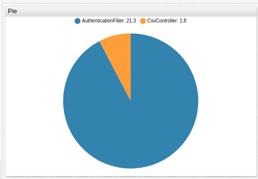
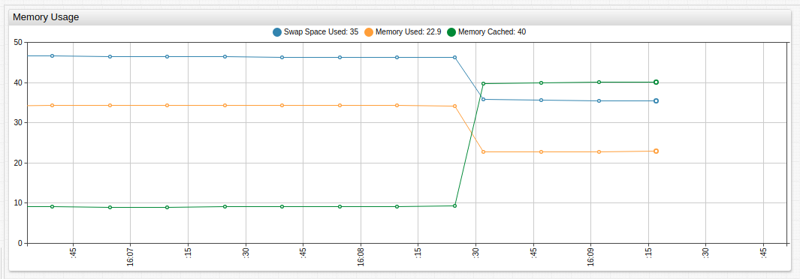
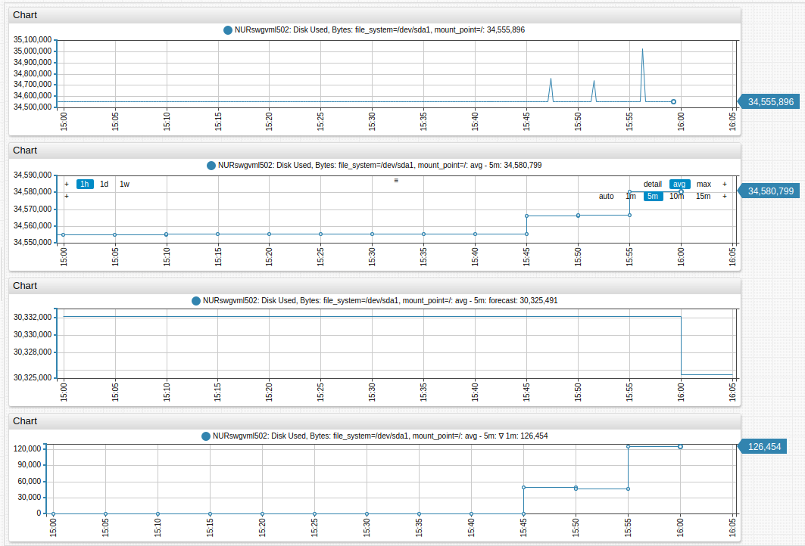
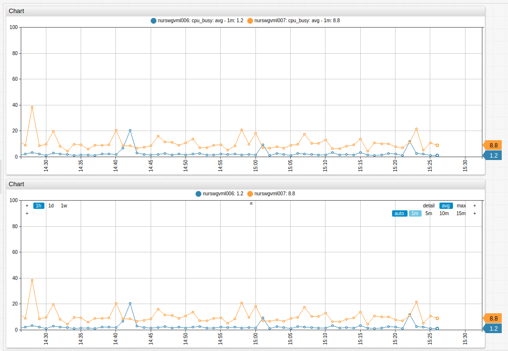
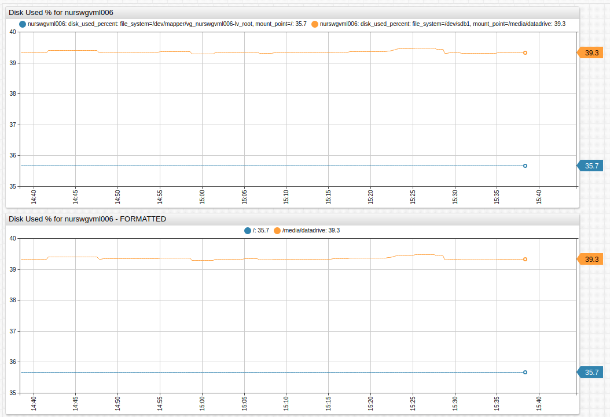
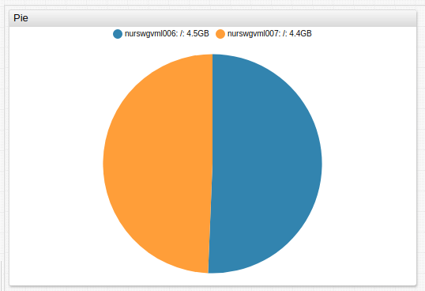

# Label Formatting

Use the `label-format` setting to customize series labels displayed in the widget legend as an alternative to specifying a custom label for each series.

The default `label-format` pattern is:

```ls
entity: metric: tags: statistics: period: dataType - forecastName: rate
```

Supported keywords in the `label-format` pattern are:

* `entity`
* `metric`
* `tags`: Semicolon-separated list of all `tag=value` pairs.
* `tagName`: Semicolon-separated list of all tag names.
* `tagValue`: Semicolon-separated list of all tag values.
* `tags.tagName`: Value of tag with name `tagName`.
* `statistics`
* `period`
* `dataType`
* `forecastName`
* `rate`
* `label`: Value of the label setting in the current series.

Create a new label format configuration using a combination of the supported keywords.

```ls
label-format = statistics : metric
```

See [Examples](#examples) for other usage.

## String Functions

Invoke built-in string functions to format series fields.

| Function | Description |
|---|---|
| `keepAfter` | Removes part of the string before the first occurrence of the given substring. |
| `keepAfterLast` | Removes part of the string before the last occurrence of the given substring.|
| `keepBefore`| Removes part of the string that starts with the first occurrence of the given substring. |
| `keepBeforeLast`| Removes part of the string that starts with the last occurrence of the given substring.|
| `replace` | Replace all occurrences of the given string in the original string with another string.|
| `capFirst`| Capitalize first word. |
| `capitalize`| Capitalize all words.  |
| `lowerCase`   | Convert to lower case.   |
| `upperCase`   | Convert to upper case.   |
| `removeBeginning` | Removes the given substring from the beginning of the string.|
| `removeEnding`| Removes the given substring from the end of the string.  |

```ls
label-format = javascript:keepAfterLast(tags.logger, '.')
#returns AuthenticationFilter
[series]
  [tags]
    logger = com.axibase.app.web.AuthenticationFilter
```



[](https://apps.axibase.com/chartlab/675c5467)

Use nested functions to apply multiple format settings.

```ls
label-format = javascript:capitalize(replace(metric, '_', ' '))
/* replace underscores with whitespace and capitalize all words */
[series]
    metric = swap_space_used
    #swap_space_used -> Swap Space Used
```



[](https://apps.axibase.com/chartlab/7518a91f/2/)

## Metadata

Use the `label-format` setting to replace `entity` and `metric` names with labels loaded from metadata.

Include the `addMeta = true` expression on the `[configuration]` level.

```ls
[configuration]
add-meta = true
/* Format label using metadata identifiers */
label-format = javascript: (meta.entity.label ? meta.entity.label : entity) + ": " + (meta.metric.label ? meta.metric.label : metric) + (tags+"" != 'null' ? ": " + tags : "") + (statistics && statistics != 'detail' ? ": " + statistics : "") + (period ? " - " + period : "") + (dataType ? ": " + dataType : "") + (rate ? ": ∇ " + rate : "")
```



[](https://apps.axibase.com/chartlab/68ff7368/3/)

## Examples

### `entity`

```ls
label-format = entity
/* Display only the entity name in the legend */
[series]
  entity = nurswgvml007
  metric = cpu_busy
[series]
  entity = nurswgvml006
  metric = cpu_busy
```



[](https://apps.axibase.com/chartlab/6ce33406)

### `tags.tagName`

```ls
label-format = tags.mount_point
/* Displays labels from tag mount_point in the legend */
[series]
  entity = nurswgvml006
  metric = disk_used_percent
  [tags]
    mount_point = *
    file_system = *  
```



[](https://apps.aschemexibase.com/chartlab/8909d7f4)

### `entity : tagValue`

```ls
label-format = entity: tagValue
/* Displays labels from entity followed by tagValue in the legend */
[tags]
  mount_point = /
[series]
  entity = nurswgvml006
```



[](https://apps.axibase.com/chartlab/5e5667fa)