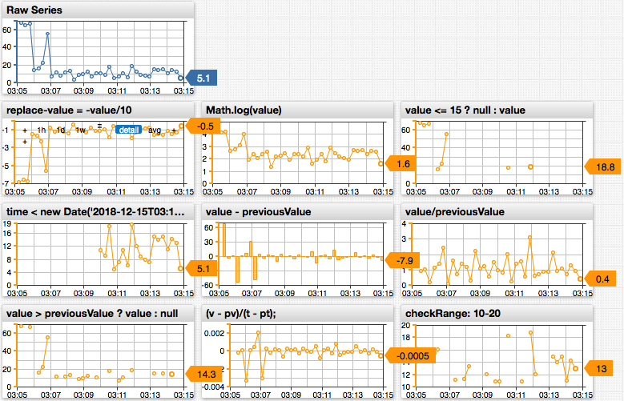

# Replace Value Functions

## Overview

This document describes fields and functions, which can be referenced in the [`replace-value`](../widgets/shared/README.md#value) setting to replace or remove values of the current series.

The `replace-value` setting is specified in the `[series]` section.

```ls
[series]
  metric = cpu_busy
  entity = nurswgvml007
  replace-value = Math.log(value)
```

## Fields

| Field | Description |
|----------|-----------|
| `value` | Value of the series at the current timestamp. |
| `previousValue` | Value at the previous timestamp. |
| `time` | Current timestamp measured as Unix time in milliseconds.  |
| `previousTime` | Previous timestamp measured as Unix time in milliseconds. |

## Examples



[](https://apps.axibase.com/chartlab/5d698223/2/)

```ls
replace-value = value/60

replace-value = Math.log(value)

replace-value = value/Math.pow(2, 20)

replace-value = -value

replace-value = Math.max(0, value)

replace-value = value <= 0 ? null : value

replace-value = time < new Date('2018-12-15T00:00:00Z').getTime() ? null : value

replace-value = time > 1519862400000 ? null : value

replace-value = (time < 1455889800000 || time > 1455890400000) ? null : value

replace-value = ( time < new Date('2016-02-19T13:50:00Z').getTime() || time > new Date('2016-02-19T14:00:00Z').getTime() ) ? value : null

replace-value = value - previousValue

replace-value = value/previousValue

replace-value = (value/previousValue - 1) * 100

replace-value = var v = value, pv = previousValue, t = time, pt = previousTime; return (pv === null) ? null : (v - pv)/(t - pt);
```

## Window Functions

Define a custom JavaScript function in the `window` object using the `script` / `endscript` section in the configuration text.

```ls
script
  window.checkRange = function (val) {
     if (val > 100) {
       return null;
     }
     return val;
  };
endscript
```

The custom function can be accessed in the `replace-value` setting by referencing it by name.

```ls
replace-value = return checkRange(value);
```

Functions in the `window` scope can be invoked in other settings that support functions, for example, in the `format` setting.
