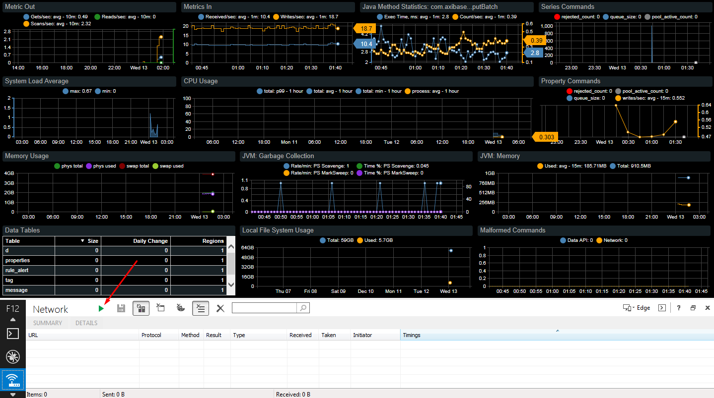
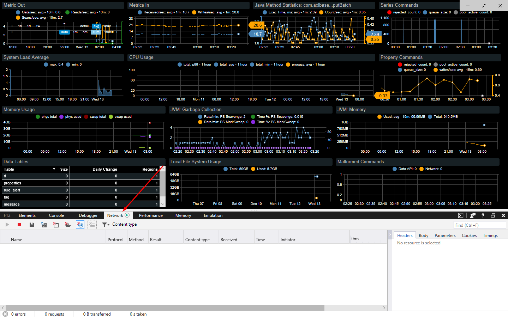

# Capture HAR

## Overview

The following instructions outline the steps required to export web browser requests generated by Axibase portals in HTTP Archive format (HAR).

* [Chrome](#chrome)
* [Internet Explorer 11](#internet-explorer-11)
* [Edge](#edge)

## Chrome

- Open a portal.

- Click `F12` on Windows or `Command+Option+I` on Mac to open Developer Tools.

- Open the **Network** panel.

  

- Click on `Clear` icon    in the toolbar to clear the request history.

- Click on the widget header. 

  
  
- The dialog mode will initiate a request into ATSD to load data for the selected widget.

  

- Right-click on the request row. Select **Copy > Copy all as HAR** option.

  

- Save the request output into a file such as `widget_xyz.har`.

## Internet Explorer 11

IE 11 unable to generate `HAR`, but instead saves the data you've recorded to an XML or CSV format.

- Open a portal.

- Click `F12` to open 'Developer Tools'.

- Open the **Network** panel with `Control+4`.

  

- Enable network traffic capturing by clicking on `F5`.

  

- Click on the widget header. 

  
  
- The dialog mode will initiate a request into ATSD to load data for the selected widget.
  
  

- Double click on the request row. Press **Export captured traffic**.

  

- Save the NetworkData.

## Edge

- Open a portal.

- Click `F12` to open Developer Tools.

- Open the **Network** panel.

  

- Click on `Clear session` icon    in the toolbar to clear the request history.

- Click on the widget header. 

  
  
- The dialog mode will initiate a request into ATSD to load data for the selected widget.

  

- Select the request row. Press **Export as HAR**.

  
  
- Save the request output into a file such as `widget_xyz.har`.

