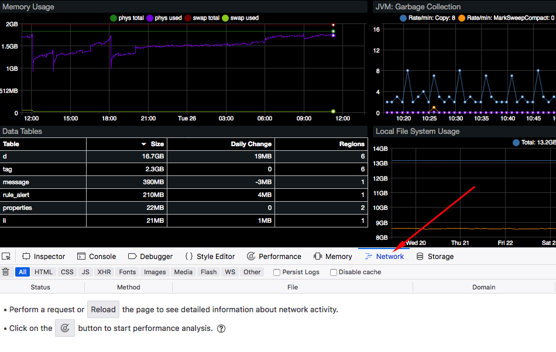
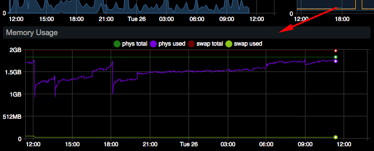
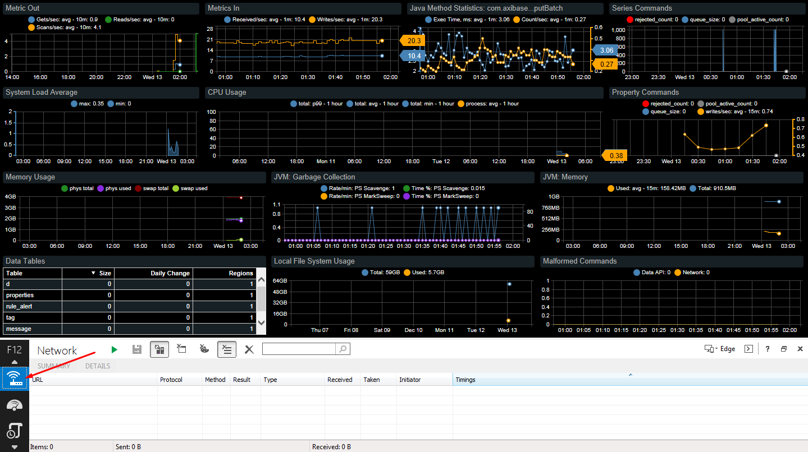
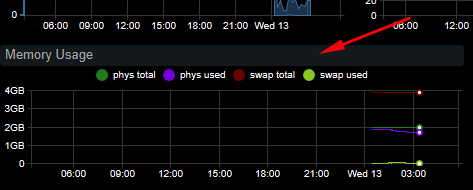

# Capture Response

## Overview

The following instructions outline the steps required to record web browser requests generated by Axibase portals.

* [Chrome](#chrome)
* [Firefox](#firefox)
* [Internet Explorer](#internet-explorer)
* [Edge](#edge)

## Chrome

* Open a portal.

* Click `F12` on Windows or `Command+Option+I` on Mac to open Developer Tools.

* Open the **Network** panel.

  

* Click the `Clear` icon    in the toolbar to clear the request history.

* Click the widget header.

  
  
* The dialog mode will initiate a request into ATSD to load data for the selected widget.

  

* Right-click the request row. Select **Copy > Copy Response** option.

* Save the request output into a file such as `widget_xyz_response.json`.

  

## Firefox

* Open a portal.

* Click `F12` on Windows or `Command+Option+I` on Mac to open Developer Tools.

* Open the **Network** panel.

  

* Click the `Clear` icon    in the toolbar to clear the request history.

* Click the widget header.

  
  
* The dialog mode will initiate a request into ATSD to load data for the selected widget.

  

* Right-click the request row. Select **Copy > Copy Response** option.

* Save the request output into a file such as `widget_xyz_response.json`.

  

## Internet Explorer

* Open a portal.

* Click `F12` to open Developer Tools.

* Open the **Network** panel with `Control+4`.

  

* Enable network traffic capturing by clicking on `F5`.

  

* Click the widget header.

  
  
* The dialog mode will initiate a request into ATSD to load data for the selected widget.

  

* Double click the request row. Select **Response body** tab.

  

* Save the request output into a file such as `widget_xyz_response.json`.

  

## Edge

* Open a portal.

* Click `F12` to open Developer Tools.

* Open the **Network** panel.

  

* Click the `Clear session` icon    in the toolbar to clear the request history.

* Click the widget header.

  
  
* The dialog mode will initiate a request into ATSD to load data for the selected widget.

  

* Right-click the request row. Select **Copy response payload** option.

* Save the request output into a file such as `widget_xyz_response.json`.

  
