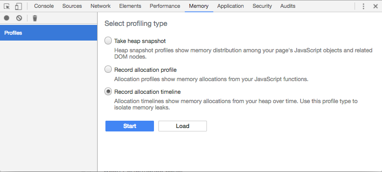

# Portal Performance Diagnostics

## Overview

The following instructions outline steps required to record JavaScript timelines and resource usage in ATSD portals.

## Google Chrome

### Capturing Performance Profile

Open an ATSD portal

Click F12 on Windows or Command+Option+I on Mac to open Developer Tools

Open Performance panel

Click on Record circle icon    in the top left bar to initiate a profiling session

Execute steps (load page, open dialog chart, click on controls) that cause performance issues

Click 'Stop' button to discontinue recording the session

Click on Arrow-Down icon    in the top toolbar to Save Profile to a json file

### Capturing Memory Profile

Open an ATSD portal

Click F12 on Windows or Command+Option+I on Mac to open Developer Tools

Open Memory panel

Choose "Record allocation timeline" radio-button.

Click "Start" button.

Execute steps (load page, open dialog chart, click on controls) that cause performance issues

Click on red Record circle icon    to discontinue recording the session

Click on "Save" to Save Profile to a heaptimeline file

