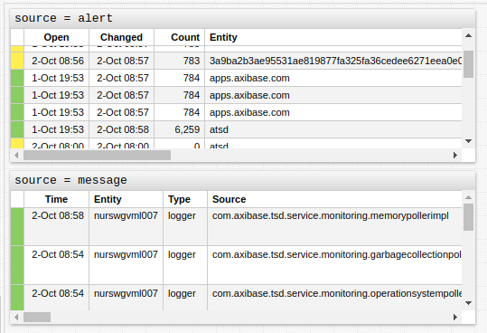

# Alert Console

## Overview

The **Alert Console** displays a continuously updated list of open alerts or messages in tabular format.

```ls
[widget]
  type = console
```


[](https://apps.axibase.com/chartlab/e373cd26)

## Widget Settings

* The settings apply to the `[widget]` section.
* [Shared](../shared/README.md#widget-settings) `[widget]` settings are inherited.
* [Shared Table](../shared-table/README.md#widget-settings) `[widget]` settings are inherited.

Name | Description | &nbsp;
:--|:--|:--
<a name="source"></a>[`source`](#source)| Specify the source of records.<br>Possible values: `alert`, `message`.<br>Default value: `alert`.<br>**Example**: `source = message`. | [↗](https://apps.axibase.com/chartlab/52548551)
<a name="rule"></a>[`rule`](#rule)| Rule for which alerts are filtered. <br>**Example**: `rule = nginx_server_accepts_counter`. | [↗](https://apps.axibase.com/chartlab/4a11cdff)
<a name="entity"></a>[`entity`](#entity)| The host or service for the widget.<br>Multiple entities can be used.<br>**Example**: `entity = nurswgvml007`.| [↗](https://apps.axibase.com/chartlab/a0b9421a)
<a name="metric"></a>[`metric`](#metric)| Select metrics for the widget.<br>Multiple metrics can be used.<br>**Example**: `metric = nmon.cpu_total.busy%`.| [↗](https://apps.axibase.com/chartlab/0e0ecc74)
<a name="severity"></a>[`severity`](#severity)| Severity rating of console alerts.<br>Possible values: `0` (Undefined), `1` (Unknown), `2` (Normal), `3` (Warning), `4` (Minor), `6` (Critical),`7` (Fatal).<br>**Example**: `severity = 6`.| [↗](https://apps.axibase.com/chartlab/2f0f96da)
<a name="severity-style"></a>[`severity-style`](#severity-style)| Control alert behavior. Highlight a single column or entire row.<br>Possible settings: `row`, `column`.<br>**Example**: `severity-style = row`.| [↗](https://apps.axibase.com/chartlab/0db89ed0/4/)
<a name="on-click"></a>[`on-click`](#on-click)| Set interaction behavior upon user click.<br>Filter the tables based on the clicked values of a specific column.<br>**Example**: `onclick = filter()`.| [↗](https://apps.axibase.com/chartlab/48fd3033)
<a name="row-style"></a>[`row-style`](#row-style)| Style assigned to the entire row specified as JavaScript code.<br>In the syntax example all alerts with severity less than `7` are hidden.<br>Filter data prior display in the widget.<br>**Example**: `row-style = if (value <= 100) return 'display: none'`. | [↗](https://apps.axibase.com/chartlab/4a14f536)
<a name="sort"></a>[`sort`](#sort)| Sort rows by value in ascending (`ASC`) or descending (`DESC`) order.<br>If the row contains multiple metrics, specify the name of the metric value to use for sorting bars.<br>**Examples**:<ul><li>`sort = DESC`<li>`sort = value ASC`</ul>|[↗](https://apps.axibase.com/chartlab/97fe70bd)
<a name="class"></a>[`class`](#class)| Change the widget to Unix-style console with black background.<br>Possible values: `terminal`.<br>**Example**: `class = terminal`.| [↗](https://apps.axibase.com/chartlab/a8eb9f57)

## Data Source

To display open alerts, set `source = alert`. To display messages, set `source = message`.

## Default Columns

Rows are color-coded based on the severity of the underlying alert or message.

Default column vary based on source.

### Default `message` Columns

* `Severity`
* `Time`
* `Entity`
* `Type`
* `Source`
* `Tags`
* `Message`

### Default `alert` Columns

* `Severity`
* `Open`
* `Changed`
* `Count` (Repeat Count)
* `Entity`
* `Rule`
* `Metric`
* `Tags`
* `Text`

## Examples

### Advanced Configuration



[](https://apps.axibase.com/chartlab/84fda148)

### Severity Style: `row`


[](https://apps.axibase.com/chartlab/f5ed12c6)

### Severity Style: `column`


[](https://apps.axibase.com/chartlab/cc0f7333)