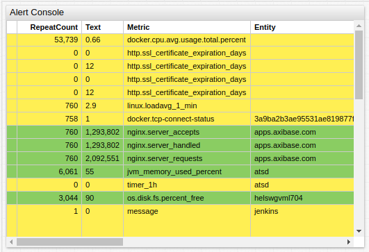
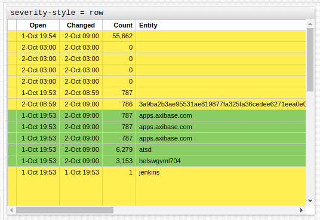
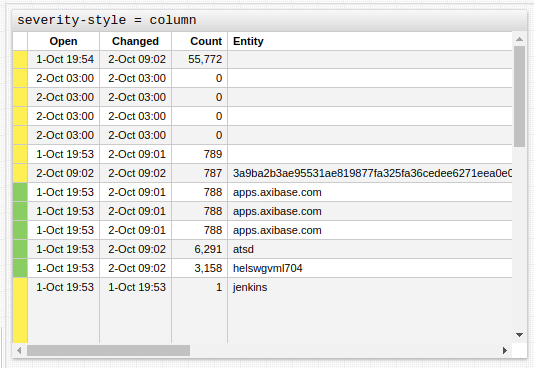

# Alert Console

## Overview

The **Alert Console** displays a continuously updated list of open alerts or messages in tabular format.

```ls
[widget]
  type = console
  severity-style = row
  
  [column]
    key = repeatCount
  [column]
    key = text
  [column]
    key = metric
  [column]
    key = entity
```



[](https://apps.axibase.com/chartlab/b8804073)

## Widget Settings

* The settings apply to the `[widget]` section.
* [Shared Table](../shared-table/README.md#widget-settings) `[widget]` settings are inherited.

Name | Example | Description | &nbsp;
:--|:--|:--|:--
<a name="source"></a>[`source`](#source) | `source = alert` | Specify the source of records.<br>Default value: `alert` | ↗
<a name="rule"></a>[`rule`](#rule) | `rule = cpu_busy_prod` | Name of rule for which alerts are filtered | [↗](https://apps.axibase.com/chartlab/0db89ed0/11/)
<a name="entity"></a>[`entity`](#entity) | `entity = nurswgvml007` | The host or service for the widget.<br>Multiple entities can be used.| [↗](https://apps.axibase.com/chartlab/0db89ed0/7/)
<a name="metric"></a>[`metric`](#metric) | `metric = loadavg.5m` | Select metrics for the widget.<br>Multiple metrics can be used.| [↗](https://apps.axibase.com/chartlab/0db89ed0/8/)
<a name="severity"></a>[`severity`](#severity) | `severity = 6` | Severity rating of alerts displayed in the console:<br>Undefined: `0`<br>Unknown: `1`<br>Normal: `2`<br>Warning: `3`<br>Minor: `4`<br>Critical: `6`<br>Fatal: `7`| [↗](https://apps.axibase.com/chartlab/0db89ed0/3/)
<a name="severity-style"></a>[`severity-style`](#severity-style) | `severity-style = row`| Control alert behavior. Highlight a single column or entire row.<br>Possible settings: `row`, `column`.| [↗](https://apps.axibase.com/chartlab/0db89ed0/4/)
<a name="onclick"></a>[`onclick`](#onclick) | `onclick = filter()` | Set interaction behavior for user click.<br>Filter the tables based on the clicked values of a specific column | [↗](https://apps.axibase.com/chartlab/0db89ed0/5/)
<a name="row-style"></a>[`row-style`](#row-style) | `row-style = if (value <= 7) return 'display: none'` | Style assigned to the entire row specified as JavaScript code.<br>In the syntax example all alerts with severity less than `7` are hidden.<br>Filter data prior display in the widget. | [↗](https://apps.axibase.com/chartlab/0db89ed0/6/)
<a name="sort"></a>[`sort`](#sort) | `sort = metric DESC` | Sort console based on one or more columns.<br>Additional ascending `ASC` or descending `DESC` parameter is accepted.| [↗](https://apps.axibase.com/chartlab/0db89ed0/9/)
<a name="class"></a>[`class`](#class) | `class = terminal` | Change the widget to Unix-style console with black background.| [↗](https://apps.axibase.com/chartlab/0db89ed0/10/)

## Data Source

To display open alerts, set `source = alert`. To display messages, set `source = message`.

## Default Columns

Rows are color-coded based on the severity of the underlying alert or message.

Default column vary based on source.

### Default `message` Columns

* `Severity`
* `Time`
* `Entity`
* `Type`
* `Source`
* `Tags`
* `Message`

### Default `alert` Columns

* `Severity`
* `Open`
* `Changed`
* `Count` (Repeat Count)
* `Entity`
* `Rule`
* `Metric`
* `Tags`
* `Text`

## Examples

### Advanced Configuration


[](https://apps.axibase.com/chartlab/84fda148)

### Severity Style: `row`



[](https://apps.axibase.com/chartlab/f5ed12c6)

### Severity Style: `column`



[](https://apps.axibase.com/chartlab/cc0f7333)