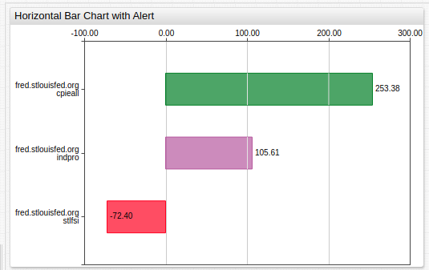
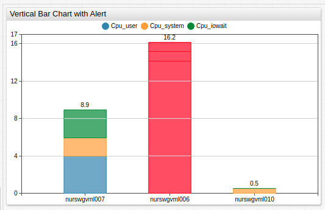

# Bar Chart

## Overview

The **Bar Chart** displays last series values as horizontal or vertical bars.

```ls
[widget]
  type = bar
  metric = cpu_busy

  [column]
    [series]
      entity = nurswgvml007

  [column]
    [series]
      entity = nurswgvml006
```


[](https://apps.axibase.com/chartlab/a522217a)

## Widget Settings

* The settings apply to the `[widget]` section.
* [Shared](../shared/README.md#widget-settings) `[widget]` settings are inherited.

Name | Description | &nbsp;
:--|:--|:--
<a name="horizontal"></a>[`horizontal`](#horizontal)| Display bars horizontally.<br>Possible values: `false`, `true`.<br>Default value: `false`.<br>**Example**: `horizontal = true`. | [↗](https://apps.axibase.com/chartlab/e0206a41)
<a name="stack"></a> [`stack`](#stack)| Disable series grouping to display each series in a separate column.<br>Possible values: `false`, `true`.<br>Default value: `true`.<br>**Example**: `stack = false`. | [↗](https://apps.axibase.com/chartlab/fe3b8818)
<a name="group"></a>[`group`](#group)|List of fields to group series series into columns.<br>Default value: `metric`.<br>**Examples**:<ul><li>`group = region`<li>`group = entity, metric`</ul>|[↗](https://apps.axibase.com/chartlab/f61bafc0)
<a name="entity-label"></a>[`entity-label`](#entity-label)|Override grouped series legend when `group = entity`.<br>**Example**: `entity-label = srv007`.|[↗](https://apps.axibase.com/chartlab/7bee2721)
<a name="metric-label"></a>[`metric-label`](#metric-label)|Override grouped series legend when `group = metric`.<br>**Example**: `metric-label = CPU Busy, %`.|[↗](https://apps.axibase.com/chartlab/7136a0aa)
<a name="display-values"></a>[`display-values`](#display-values)|Display bar values.<br>If `mode = stack`, displayed total represents sum of all included series.<br>Possible values: `false`, `true`.<br>Default value: `true`.<br>**Example**: `display-values = false`.|[↗](https://apps.axibase.com/chartlab/29f11556)
<a name="display-panels"></a>[`display-panels`](#display-panels)| Show chart control panel.<br>Possible values: `false`, `true`, `hover`.<br>Default value: `hover`.<br>**Example**: `display-panels = true`.| [↗](https://apps.axibase.com/chartlab/393bb551)
<a name="rotate-ticks"></a>[`rotate-ticks`](#rotate-ticks)| Rotate labels on the `x` axis by `n` degrees.<br>Possible values: `true` (vertical), and `0` (horizontal) to `90` (vertical).<br>Default value: `0`.<br>**Examples**:<ul><li>`rotate-ticks = 45`<li>`rotate-ticks = true`</ul>|[↗](https://apps.axibase.com/chartlab/fdc4d681)
<a name="sort"></a>[`sort`](#sort)| Sort bars by value in ascending (`ASC`) or descending (`DESC`) order.<br>If the column contains multiple metrics, specify the name of the metric which value to use for sorting bars.<br>When `mode = stack`, bars are sorted by **total** grouped value.<br>If a column has multiple series, keyword in `sort` setting represents the sum of series values.<br>**Examples**:<ul><li>`sort = DESC`<li>`sort = value ASC`<li>`sort = cpu_busy DESC`</ul>|[↗](https://apps.axibase.com/chartlab/ab989019)
<a name="hide-empty-columns"></a>[`hide-empty-columns`](#hide-empty-columns)|Hide columns with no data.<br>Possible values: `false`, `true`.<br>Default value: `false`.<br>**Example**: `hide-empty-columns = true`.|[↗](https://apps.axibase.com/chartlab/e4603a5f)

## Column Settings

* The settings apply to the `[column]` section.

Name | Description | &nbsp;
:--|:--|:--
<a name="column-alert-expression"></a>[`column-alert-expression`](#column-alert-expression)| Boolean expression to apply  conditional style to bars.<br>The CSS style must be specified in the `column-alert-style` setting.<br> The `value` field contains the total of all series in the given bar.<br>**Example**: `column-alert-expression = value > 10`.|[↗](https://apps.axibase.com/chartlab/c6b766ba)
<a name="column-alert-style"></a>[`column-alert-style`](#column-alert-style)| CSS style applied to the bar rectangle if `column-alert-expression` is `true`.<br>**Example**: `column-alert-style = fill: red; stroke: red`. | [↗](https://apps.axibase.com/chartlab/66a259c4)
<a name="column-label-format"></a>[`column-label-format`](#column-label-format) |Column label pattern containing text and placeholders.<br>Supported placeholders: `entity`, `metric`, `tagName`, `tagValue`,`tags.{tag-name}`,`statistics`, `period`.<br>Default value: `entity: metric: tagName=tagValue: statistics - period`.<br>**Example**: `column-label-format = tags.mount_point`.|[↗](https://apps.axibase.com/chartlab/7afc353a)
<a name="multiple-column"></a>[`multiple-column`](#multiple-column)|Applies to [wildcard](../../syntax/wildcards.md) series.<br>If `true`, series with the same entity and tags are grouped in the same column.<br>This applies to derived series which are placed in the same column alongside the underlying series.<br>Possible settings: `false`, `true`.<br>Default value: `false`.<br>**Example**: `multiple-column = true`.|[↗](https://apps.axibase.com/chartlab/b1609460)

## Examples

### Horizontal Bar Chart


[](https://apps.axibase.com/chartlab/e1784607)

### Horizontal Alert



[](https://apps.axibase.com/chartlab/edb33933)

### Vertical Bar Chart


[](https://apps.axibase.com/chartlab/ee71211d)

### Vertical Alert



[](https://apps.axibase.com/chartlab/0a9ad3ee)
