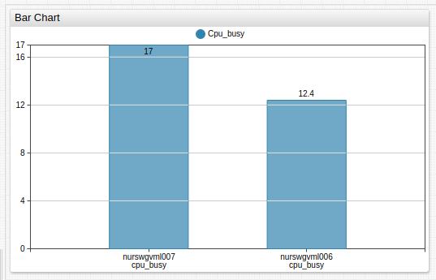
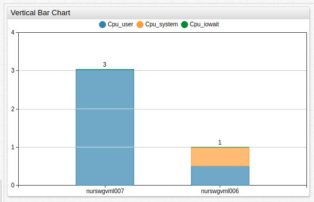

# Bar Chart

## Overview

The **Bar Chart** displays last series values as horizontal or vertical bars.

```ls
[widget]
  type = bar
  timespan = 15 minute
  metric = cpu_busy

  [column]
    [series]
      entity = nurswgvml007

  [column]
    [series]
      entity = nurswgvml006
```



[](https://apps.axibase.com/chartlab/da38d063)

## Widget Settings

* The settings apply to the `[widget]` section.
* [Shared](../shared/README.md#widget-settings) `[widget]` settings are inherited.

Name | Example | Description | &nbsp;
:--|:--|:--|:--
<a name="horizontal"></a>[`horizontal`](#horizontal) | `horizontal = true` | Display bars horizontally.<br>Default value: `false`. | [↗](https://apps.axibase.com/chartlab/e0206a41)
<a name="stack"></a> [`stack`](#stack) | `stack = false` | Disable series grouping to display each series in a separate column.<br>Default value: `true`. | [↗](https://apps.axibase.com/chartlab/fe3b8818)
<a name="group"></a>[`group`](#group)|`group = region`<br>`group = entity, metric`|List of fields to group series series into columns.<br>Default value: `metric`.|[↗](https://apps.axibase.com/chartlab/f61bafc0)
<a name="entity-label"></a>[`entity-label`](#entity-label)|`entity-label = srv007`|Override grouped series legend when `group=entity`.|[↗](https://apps.axibase.com/chartlab/7bee2721)
<a name="metric-label"></a>[`metric-label`](#metric-label)|`metric-label = CPU Busy, %`|Override grouped series legend when `group=metric`.|[↗](https://apps.axibase.com/chartlab/7136a0aa)
<a name="colors"></a>[`colors`](#colors)|`colors = green, steelblue, orange`|Series colors.|[↗](https://apps.axibase.com/chartlab/163cd950)
<a name="display-values"></a>[`display-values`](#display-values)|`display-values = false`|Show or hide bar values.<br>If `mode = stack`, displayed total represents sum of all included series.<br>Default value: `true`.|[↗](https://apps.axibase.com/chartlab/29f11556)
<a name="rotate-ticks"></a>[`rotate-ticks`](#rotate-ticks)|`rotate-ticks = 45`<br>`rotate-ticks = true`| Rotate labels on the `x` axis by `n` degrees.<br>Set to `true` to rotate ticks by `90` degrees clockwise.<br>Default value: `0`.|[↗](https://apps.axibase.com/chartlab/68a42888)
<a name="sort"></a>[`sort`](#sort)|`sort = DESC`<br>`sort = value ASC`<br>`sort = cpu_busy DESC` | Sort bars by value in ascending (`ASC`) or descending (`DESC`) order.<br>If the column contains multiple metrics, specify the name of the metric which value to use for sorting bars.<br>When `mode = stack`, bars are sorted by **total** grouped value.<br>If a column has multiple series, keyword in `sort` setting represents the sum of series values.|[↗](https://apps.axibase.com/chartlab/ab989019)
<a name="hide-empty-columns"></a>[`hide-empty-columns`](#hide-empty-columns)|`hide-empty-columns = true`|Show or hide columns with no data.<br>Default value: `false`.|[↗](https://apps.axibase.com/chartlab/e4603a5f)<br>[↗](https://apps.axibase.com/chartlab/27050141)

## Column Settings

* The settings apply to the `[column]` section.

Name | Example | Description | &nbsp;
:--|:--|:--|:--
<a name="label"></a>[`label`](#label)|`label = Column-1`|Column legend label displayed below series columns.|[↗](https://apps.axibase.com/chartlab/4ceaa563)
<a name="column-alert-expression"></a>[`column-alert-expression`](#column-alert-expression)|`column-alert-expression = value > 10` | Boolean expression to apply  conditional style to bars.<br>The CSS style must be specified in the `column-alert-style` setting.<br> The `value` field contains the total of all series in the given bar.|[↗](https://apps.axibase.com/chartlab/c6b766ba)
<a name="column-alert-style"></a>[`column-alert-style`](#column-alert-style) | `column-alert-style = fill: red; stroke: red` | CSS style applied to the bar rectangle if `column-alert-expression` is `true`. | [↗](https://apps.axibase.com/chartlab/66a259c4)
<a name="column-label-format"></a>[`column-label-format`](#column-label-format)`column-label-format = tags.mount_point`|Column label pattern containing text and placeholders.<br>Supported placeholders: `entity`, `metric`, `tagName`, `tagValue`,`tags.{tag-name}`,`statistics`, `period`<br>Default value: `entity: metric: tagName=tagValue: statistics - period`|[↗](https://apps.axibase.com/chartlab/7afc353a)
<a name="multiple-column"></a>[`multiple-column`](#multiple-column)|`multiple-column = true`|Applies to [wildcard](../../syntax/wildcards.md) series.<br>Default value: `false`.<br>If `true`, series with the same entity and tags are grouped in the same column.<br>This applies to derived series which are placed in the same column alongside the underlying series.|[↗](https://apps.axibase.com/chartlab/b1609460)

## Series Settings

* The settings apply to  the `[series]` section.
* [Shared](../shared/README.md#series-settings) `[series]` settings are inherited.

Name | Example | Description | &nbsp;
:--|:--|:--|:--
<a name="alert-expression"></a>[`alert-expression`](#alert-expression)|`alert-expression = value > 10`|Boolean expression to apply  conditional style to the series rectangle.<br>The CSS style must be specified in the `alert-style` setting.<br> The `value` field refers to the series value.|[↗](https://apps.axibase.com/chartlab/da384229)
<a name="alert-style"></a>[`alert-style`](#alert-style) | `alert-style = fill: red; stroke: red` | CSS style applied to the series rectangle if `alert-expression` is `true`.| [↗](https://apps.axibase.com/chartlab/754d2f99)

## Examples

### Horizontal Bar Chart


[](https://apps.axibase.com/chartlab/e1784607)

### Horizontal Alert


[](https://apps.axibase.com/chartlab/edb33933)

### Vertical Bar Chart



[](https://apps.axibase.com/chartlab/ee71211d)

### Vertical Alert


[](https://apps.axibase.com/chartlab/0a9ad3ee)
