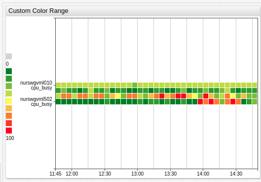

# Calendar Chart

## Overview

The **Calendar Chart** displays the deviation of aggregated series values for a calendar period from a specified threshold. Series values within each period are aggregated by [statistical function](../../configuration/aggregators.md) and assigned a color which reflects the magnitude of deviation.

```ls
[widget]
  title = Calendar Chart
  type = calendar
  time-span = 3 hour
  metric = cpu_busy
  statistic = percentile_95
  period = 5 minute

  [series]
    entity = nurswgvml006
  [series]
    entity = nurswgvml007
```


[](https://apps.axibase.com/chartlab/b9406af1)

## Widget Settings

* The settings apply to the `[widget]` section.
* [Shared](../shared/README.md#widget-settings) `[widget]` settings are inherited.

Name | Example | Description | &nbsp;
:--|:--|:--|:--
[`summarize-period`](#summarize-period) | `summarize-period = 1 hour` | Period specified as the number of [time units](https://axibase.com/docs/atsd/api/data/series/time-unit.html).<br>Possible values: `auto`, `count time_unit`.<br>Default value: `auto` (`5 minutes`) | [↗](https://apps.axibase.com/chartlab/fb935e05/14/)
[`summarize-statistic`](#summarize-statistic) | `summarize-statistic = percentile_75`<br>`summarize-statistic = avg` | [Statistical function](../../configuration/aggregators.md) applied to values within each period.<br>Possible values: `avg`, `max`, `min`, `sum`, `count`, `percentile_99`, `percentile_95`, `percentile_90`, `percentile_75`, `percentile_50`, `median`.<br>Default value: `avg`.| [↗](https://apps.axibase.com/chartlab/fb935e05/23/)
[`color-range`](#color-range) | `color-range = green yellow orange`| Calendar color range.<br>Each color signifies the sample value relative to the threshold: less than, equal to, and greater than, respectively. |[↗](https://apps.axibase.com/chartlab/f5b91025)
[`gradient-count`](#gradient-range) | `gradient-count = 2` | Amount of gradient colors between each color defined by `color-range`. | [↗](https://apps.axibase.com/chartlab/d6aff99d)
[`palette-ticks`](#palette-ticks) | `palette-ticks = true` | Display legend labels.<br>Boolean expression.<br>Default Value: `false` | [↗](https://apps.axibase.com/chartlab/b9961101)
[`rotate-palette-ticks`](#rotate-palette-ticks) | `rotate-palette-ticks = true` | Rotate legend labels.<br>Boolean expression, `true` corresponds to vertical.<br>Default value: `false`.| [↗](https://apps.axibase.com/chartlab/0f9e807b/2/)
[`range-merge`](#range-merge) | `range-merge = true` | Compute a single set of ranges for all series with minimum and maximum from all loaded series.<br>Boolean expression.<br>Default value: `false`. | [↗](https://apps.axibase.com/chartlab/0f9e807b/4/)
[`sort`](#sort) | `sort = name DESC` | Sort entities by name or value in ascending (`ASC`) or descending (`DESC`) order.<br> | [↗](https://apps.axibase.com/chartlab/431e0d53)

### Series Settings

* The settings apply to the `[series]` section.
* [Shared](../shared/README.md#series-settings) `[series]` settings are inherited.

Name | Example | Description | &nbsp;
:--|:--|:--|:--
[`thresholds`](#thresholds) | `thresholds = 0, 25, 50, 75, 100` | Threshold values by which series values are assigned colors.| [↗](https://apps.axibase.com/chartlab/0c1b1096)

## Examples

### Custom Color Range



[](https://apps.axibase.com/chartlab/bb02e108)

### Legend Position


[](https://apps.axibase.com/chartlab/a195dabf)

### No Threshold


[](https://apps.axibase.com/chartlab/4b8c3765)

### Threshold


[](https://apps.axibase.com/chartlab/48392984)