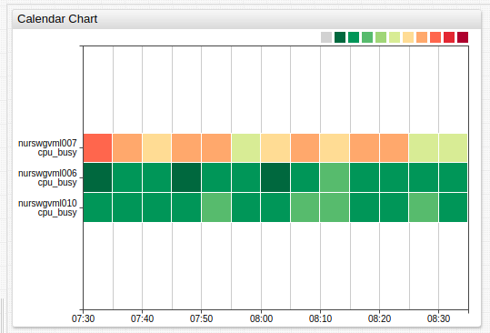
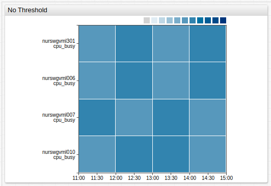

# Calendar Chart

## Overview

The **Calendar Chart** displays the deviation of aggregated series values for a calendar period from a specified threshold. Series values within each period are aggregated by [statistical function](../../configuration/aggregators.md) and assigned a color which reflects the magnitude of deviation.

```ls
[widget]
  type = calendar
  metric = cpu_busy
  thresholds = 0, 10, 20
  color-range = red

  [series]
    entity = nurswgvml0*
```



[](https://apps.axibase.com/chartlab/1d891aa7)

## Widget Settings

* The settings apply to the `[widget]` section.
* [Shared](../shared/README.md#widget-settings) `[widget]` settings are inherited.

Name | Description | &nbsp;
:--|:--|:--
<a name="summarize-period"></a>[`summarize-period`](#summarize-period)| Period specified in [time units](https://axibase.com/docs/atsd/api/data/series/time-unit.html) to split loaded time series into calendar segments.<br>Format: `count time_unit`.<br>Default value: `5 minute`.<br>**Example**: `summarize-period = 1 hour`| [↗](https://apps.axibase.com/chartlab/6a3f5153)
<a name="summarize-statistic"></a>[`summarize-statistic`](#summarize-statistic) | Statistical function applied to values within each period.<br>Refer to [Aggregators](../../configuration/aggregators.md) for possible values.<br>Default value: `avg`.<br>**Example**: `summarize-statistic = percentile_75`| [↗](https://apps.axibase.com/chartlab/548fa0ae)
|<a name="color-range"></a>[`color-range`](#color-range)|Color palette assigned to threshold ranges.<br>Possible values: [color names](https://en.wikipedia.org/wiki/Web_colors).<br>Built-in ranges: `red`, `blue`, `black`.<br>**Example**: `color-range = black`|[↗](https://apps.axibase.com/chartlab/7517e646)|
<a name="gradient-count"></a>[`gradient-count`](#gradient-count)| Number of gradients per threshold range.<br>Default value: `3`.<br>**Example**: `gradient-count = 2`| [↗](https://apps.axibase.com/chartlab/a789a6cc)
<a name="palette-ticks"></a>[`palette-ticks`](#palette-ticks)| Display legend labels.<br>Possible values: `false`, `true`.<br>Default Value: `false`.<br>**Example**: `palette-ticks = true`| [↗](https://apps.axibase.com/chartlab/01a10bbf)
<a name="rotate-palette-ticks"></a>[`rotate-palette-ticks`](#rotate-palette-ticks)| Rotate legend labels.<br>Possible values: `false` (horizontal), `true` (vertical).<br>Default value: `false`.<br>**Example**: `rotate-palette-ticks = true`| [↗](https://apps.axibase.com/chartlab/0d232c4f)
<a name="range-merge"></a>[`range-merge`](#range-merge)| Compute a single range for all series with minimum and maximum from all loaded series.<br>Possible values: `false`, `true`.<br>Default value: `false`.<br>**Example**: `range-merge = true`| [↗](https://apps.axibase.com/chartlab/56a3859a)
<a name="sort"></a>[`sort`](#sort)| Sort entities by name or value in ascending (`ASC`) or descending (`DESC`) order.<br>**Example**: `sort = name DESC`| [↗](https://apps.axibase.com/chartlab/fc8bd510)

### Series Settings

* The settings apply to the `[series]` section.
* [Shared](../shared/README.md#series-settings) `[series]` settings are inherited.

Name | Description | &nbsp;
:--|:--|:--
<a name="thresholds"></a>[`thresholds`](#thresholds)| Threshold values.<br>The number of specified [`colors`](#colors) must be `1` fewer than the number of thresholds.<br>**Example**: `thresholds = 0, 50, 90, 100`| [↗](https://apps.axibase.com/chartlab/47688faa)
<a name="colors"></a>[`colors`](#colors)| Comma separated list of color [names](https://en.wikipedia.org/wiki/Web_colors) or hex codes, assigned to threshold ranges.<br>The number must be `1` fewer than the number of thresholds.<br>**Example**: `colors = green, yellow, red`| [↗](https://apps.axibase.com/chartlab/5b7cc24e)

## Examples

### Custom Color Range


[](https://apps.axibase.com/chartlab/3d52aae0)

### Legend Position


[](https://apps.axibase.com/chartlab/f354914c)

### No Threshold



[](https://apps.axibase.com/chartlab/7d6224b8)

### Threshold


[](https://apps.axibase.com/chartlab/5f49b168)
