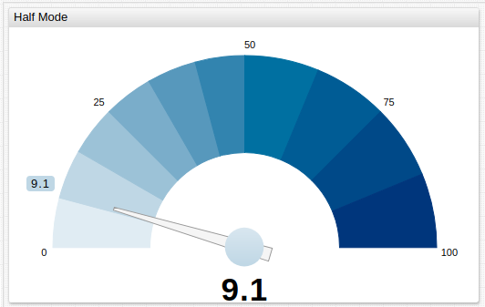

# Gauge Chart

## Overview

The **Gauge Chart** displays last series value on a gauge with colored threshold ranges.

```ls
[widget]
  type = gauge
  thresholds = 0
  thresholds = 100

  [series]
    entity = nurswgvml006
    metric = cpu_busy
```


[](https://apps.axibase.com/chartlab/d84140e2)

## Widget Settings

* The settings apply to the `[widget]` section.
* [Shared](../shared/README.md) `[widget]` settings are inherited.

Name | Example | Description | &nbsp;
:--|:--|:--|:--
|<a name="mode"></a>[`mode`](#mode)|`mode = sleek`|Widget mode.<br>Possible values: `sleek`, `half`.|[↗](https://apps.axibase.com/chartlab/d7016bd7)|
|<a name="thresholds"></a>[`thresholds`](#thresholds)|`thresholds = 0, 50, 90, 100`|Comma-separated threshold **absolute** values or expressions which split the gauge axis into multiple ranges.<br>Assign each range a color with the `colors` or `color-range` setting. |[↗](https://apps.axibase.com/chartlab/01288425/24/)|
|<a name="colors"></a>[`colors`](#colors)|`colors = green, yellow, red`|Color of each threshold range.<br>Each color is assigned to a threshold range.<br>If there are more colors than threshold ranges, a second color is assigned to the lowest threshold range first.|[↗](https://apps.axibase.com/chartlab/01288425/24/)|
|<a name="color-range"></a>[`color-range`](#color-range)|`color-range = black`|Color palette automatically assigned to threshold ranges.<br>Possible values: `red`, `blue`, `black`.|[↗](https://apps.axibase.com/chartlab/d5f9b1a4)|
|<a name="gradient-intensity"></a>[`gradient-intensity`](#gradient-intensity)|`gradient-intensity = -20% / 70%`|Contrast of each color range in a gauge.<br>Possible values: `-.2/.7` notation or `-20%/70%` notation.|[↗](https://apps.axibase.com/chartlab/0e2b04c8)|
|<a name="gradient-count"></a>[`gradient-count`](#gradient-count)|`gradient-count = 2, 4, 6, 8`|Number of gradient sections in each color range.<br>If `gradient-count` has a greater number of values than specified `colors`, additional sections are colored `black`.<br>If more `colors` are specified than `gradient-count` values, additional sections have `0` gradients. |[↗](https://apps.axibase.com/chartlab/afe2a26c)|
|<a name="caption"></a>[`caption`](#caption)|`caption = <h1>Operating System`|Text displayed above gauge.<br>HTML Markup is supported.|[↗](https://apps.axibase.com/chartlab/01288425/25/)|
|<a name="caption-style"></a>[`caption-style`](#caption-style)|`caption-style = font-size: 64px; font-weight: bold; color: silver;`|CSS style applied to caption.|[↗](https://apps.axibase.com/chartlab/01288425/28/)|
|<a name="ticks"></a>[`ticks`](#ticks)|`ticks = 4`|Number of major ticks on gauge axis.<br>Default value: `3`|[↗](https://apps.axibase.com/chartlab/01288425/11/)|
|<a name="minor-ticks"></a>[`minor-ticks`](#minor-ticks)|`minor-ticks = 4`|Number of minor ticks per major tick.<br>Default value: `0`|[↗](https://apps.axibase.com/chartlab/01288425/12/)|
|<a name="display-ticks"></a>[`display-ticks`](#display-ticks)|`display-ticks = true`|Display ticks on the axis.<br>Boolean expression.<br>Default value: `true`.|[↗](https://apps.axibase.com/chartlab/01288425/33/)|
|<a name="counter-position"></a>[`counter-position`](#counter-position)|`counter-position = none`|Counter position.<br>Possible values: `top`, `bottom`, `none`.<br>Default value: `bottom`.|[↗](https://apps.axibase.com/chartlab/01288425/31/)|
|<a name="display-tip"></a>[`display-tip`](#display-tip)|`display-tip = false`|Value tip marker.<br>Boolean expression.<br>Default value: `true`.|[↗](https://apps.axibase.com/chartlab/01288425/30/)|
|<a name="format-tip"></a>[`format-tip`](#format-tip)|`format-tip = d3.format("0.1f")`<br>`format-tip = kilobytes`|Value tip format.<br>Refer to [Label Formatting](../../syntax/label-formatting.md) for possible values.|[↗](https://apps.axibase.com/chartlab/01288425/29/)|
|<a name="format-axis"></a>[`format-axis`](#format-axis)|`format-axis = Math.round(value * 10)/10 + "%"`|Value axis format.<br>Refer to [Label Formatting](../../syntax/label-formatting.md) for possible values.|[↗](https://apps.axibase.com/chartlab/01288425/29/)|
|<a name="format-counter"></a>[`format-counter`](#format-counter)|`format-counter = d3.format("0.3f")`|Counter format.<br>Refer to [Label Formatting](../../syntax/label-formatting.md) for possible values.|[↗](https://apps.axibase.com/chartlab/01288425/29/)|
|<a name="ring-width"></a>[`ring-width`](#ring-width)|`ring-width = 0.2`|Width of the gauge ring area.<br>Percent of total possible width.<br>Possible values:<br>**Inclusively** between `0` and `1`.|[↗](https://apps.axibase.com/chartlab/3134e9d6)|
|<a name="border-width"></a>[`border-width`](#border-width)|`border-width = 0.3`|Offset between gauge ring and container.<br>Percent of total possible radius.<br>Possible values:<br>**Inclusively** between `0` and `1`.|[↗](https://apps.axibase.com/chartlab/3134e9d6/2)|
|<a name="pin-radius"></a>[`pin-radius`](#pin-radius)|`pin-radius = 0.2`|Radius of pin circle.<br>Percent of total possible radius.<br>Possible values:<br>**Inclusively** between `0` and `1`.|[↗](https://apps.axibase.com/chartlab/ea2d99cf)|
|<a name="arrow-length"></a>[`arrow-length`](#arrow-length)|`arrow-length = 0.3`|Length of gauge arrow.<br>Percent of total possible length.<br>Possible values:<br>**Inclusively** between `0` and `1`.|[↗](https://apps.axibase.com/chartlab/ea2d99cf/2/)|

## Examples

### Default Style


[](https://apps.axibase.com/chartlab/2c983790)

### `half` Mode



[](https://apps.axibase.com/chartlab/2fd9e1b1)

### `sleek` Mode


[](https://apps.axibase.com/chartlab/01141aa9)

### Thresholds


[](https://apps.axibase.com/chartlab/01288425/20/)

### Advanced Configuration Example


[](https://apps.axibase.com/chartlab/a22d8ee0)
