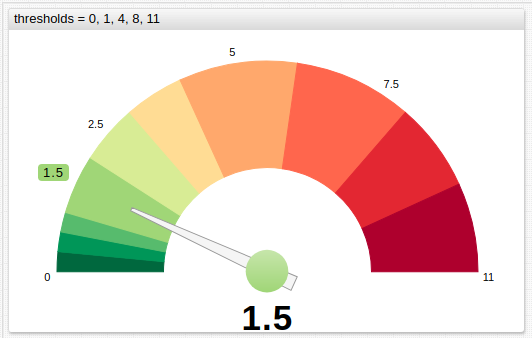

# Gauge Chart

## Overview

The **Gauge Chart** displays last series value on a gauge with colored threshold ranges.

```ls
[widget]
  type = gauge
  thresholds = 0, 100

  [series]
    entity = nurswgvml006
    metric = cpu_busy
```


[](https://apps.axibase.com/chartlab/dbe74cff)

## Widget Settings

* The settings apply to the `[widget]` section.
* [Shared](../shared/README.md#widget-settings) `[widget]` settings are inherited.

Name | Example | Description | &nbsp;
:--|:--|:--|:--
|<a name="mode"></a>[`mode`](#mode)|`mode = sleek`|Gauge mode.<br>Possible values: `sleek`, `half`.|[↗](https://apps.axibase.com/chartlab/527286dc)|
|<a name="thresholds"></a>[`thresholds`](#thresholds)|`thresholds = 0, 50, 90, 100`|Threshold values. |[↗](https://apps.axibase.com/chartlab/7cc6b7c8)|
|<a name="colors"></a>[`colors`](#colors)|`colors = black, red, yellow, green`|Threshold colors.<br>Each color is assigned to a threshold range.<br>If there are more colors than threshold ranges, additional colors are assigned to the lowest threshold range first.<br>If there are less, additional thresholds are colored `black`. |[↗](https://apps.axibase.com/chartlab/f40088a8)|
|<a name="color-range"></a>[`color-range`](#color-range)|`color-range = black`|Color palette assigned to threshold ranges.<br>Possible values: `red`, `blue`, `black`.|[↗](https://apps.axibase.com/chartlab/2969abb3)|
|<a name="gradient-intensity"></a>[`gradient-intensity`](#gradient-intensity)|`gradient-intensity = -.25 / .25`|Gauge color range contrast.<br>Possible values: `-.2/.7` notation or `-20%/70%` notation.|[↗](https://apps.axibase.com/chartlab/707b0f17)|
|<a name="gradient-count"></a>[`gradient-count`](#gradient-count)|`gradient-count = 2, 4, 6, 8`|Gradient sections within each color range.<br>If `gradient-count` is greater than specified `colors`, additional sections are colored `black`.<br>If more `colors` are specified than `gradient-count` values, additional sections have `0` gradients. |[↗](https://apps.axibase.com/chartlab/da0444e0)|
|<a name="caption"></a>[`caption`](#caption)|`caption = <h1>Operating System`|Gauge text.<br>HTML Markup is supported.|[↗](https://apps.axibase.com/chartlab/1436de22)|
|<a name="caption-style"></a>[`caption-style`](#caption-style)|`caption-style = font-size: 64px; font-weight: bold; color: silver;`|Caption CSS style.|[↗](https://apps.axibase.com/chartlab/32435859)|
|<a name="ticks"></a>[`ticks`](#ticks)|`ticks = 4`|Major ticks on gauge axis.<br>Default value: `3`|[↗](https://apps.axibase.com/chartlab/2030dce2)|
|<a name="minor-ticks"></a>[`minor-ticks`](#minor-ticks)|`minor-ticks = 4`|Minor ticks per major tick.<br>Default value: `0`|[↗](https://apps.axibase.com/chartlab/19ba231a)|
|<a name="display-ticks"></a>[`display-ticks`](#display-ticks)|`display-ticks = true`|Display axis ticks.<br>Possible values: `false`, `true`.<br>Default value: `true`.|[↗](https://apps.axibase.com/chartlab/d27397ab)|
|<a name="counter-position"></a>[`counter-position`](#counter-position)|`counter-position = none`|Counter position.<br>Possible values: `top`, `bottom`, `none`.<br>Default value: `bottom`.|[↗](https://apps.axibase.com/chartlab/68c1d524)|
|<a name="display-tip"></a>[`display-tip`](#display-tip)|`display-tip = false`| Show series value.<br>Possible values: `false`, `true`.<br>Default value: `true`.|[↗](https://apps.axibase.com/chartlab/fab55bb4)|
|<a name="format-tip"></a>[`format-tip`](#format-tip)|`format-tip = d3.format("0.1f")`|Series value format.|[↗](https://apps.axibase.com/chartlab/f84ddeb3)|
|<a name="format-axis"></a>[`format-axis`](#format-axis)|`format-axis = Math.round(value * 10)/10 + "%"`|Gauge axis values format.|[↗](https://apps.axibase.com/chartlab/b5d44b15)|
|<a name="format-counter"></a>[`format-counter`](#format-counter)|`format-counter = d3.format("0.3f")`|Counter value format.|[↗](https://apps.axibase.com/chartlab/b6172091)|
|<a name="ring-width"></a>[`ring-width`](#ring-width)|`ring-width = 0.2`|Gauge ring width.<br>Percent of total possible width.<br>Possible values: **Inclusively** between `0` and `1`.|[↗](https://apps.axibase.com/chartlab/ded3dbb6)|
|<a name="border-width"></a>[`border-width`](#border-width)|`border-width = 0.2`|Offset between gauge ring and container.<br>Percent of total possible radius.<br>Possible values: **Inclusively** between `0` and `1`.|[↗](https://apps.axibase.com/chartlab/7b7dd137)|
|<a name="pin-radius"></a>[`pin-radius`](#pin-radius)|`pin-radius = 0.2`|Pin circle radius.<br>Percent of total possible radius.<br>Possible values: **Inclusively** between `0` and `1`.|[↗](https://apps.axibase.com/chartlab/c1fc2e57)|
|<a name="arrow-length"></a>[`arrow-length`](#arrow-length)|`arrow-length = 0.3`|Length of gauge arrow.<br>Percent of total possible length.<br>Possible values: **Inclusively** between `0` and `1`.|[↗](https://apps.axibase.com/chartlab/989ac542)|

## Examples

### Default Style


[](https://apps.axibase.com/chartlab/2c983790)

### `half` Mode


[](https://apps.axibase.com/chartlab/2fd9e1b1)

### `sleek` Mode


[](https://apps.axibase.com/chartlab/01141aa9)

### Thresholds



[](https://apps.axibase.com/chartlab/01288425/20/)

### Advanced Configuration Example


[](https://apps.axibase.com/chartlab/a22d8ee0)
