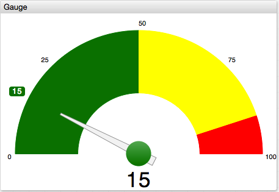
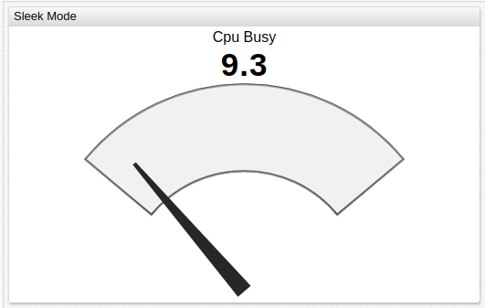

# Gauge Chart

## Overview

The **Gauge Chart** displays last series value on a gauge with colored threshold ranges.

```ls
[widget]
  type = gauge
  thresholds = 0, 100

  [series]
    entity = nurswgvml006
    metric = cpu_busy
```



[](https://apps.axibase.com/chartlab/dbe74cff)

## Widget Settings

* The settings apply to the `[widget]` section.
* [Shared](../shared/README.md#widget-settings) `[widget]` settings are inherited.

Name | Description | &nbsp;
:--|:--|:--
|<a name="mode"></a>[`mode`](#mode)|Gauge mode.<br>Possible values: `sleek`, `half`.<br>**Example**: `mode = sleek`.|[↗](https://apps.axibase.com/chartlab/527286dc)|
|<a name="thresholds"></a>[`thresholds`](#thresholds)| Threshold values.<br>The number of specified [`colors`](#colors) must be `1` fewer than the number of thresholds.<br>**Example**: `thresholds = 0, 50, 90, 100`.| [↗](https://apps.axibase.com/chartlab/7cc6b7c8)|
|<a name="color-range"></a>[`color-range`](#color-range)|Color palette assigned to threshold ranges.<br>Possible values: [color names](https://en.wikipedia.org/wiki/Web_colors).<br>Built-in ranges: `red`, `blue`, `black`.<br>**Example**: `color-range = black`.|[↗](https://apps.axibase.com/chartlab/2969abb3)|
|<a name="gradient-intensity"></a>[`gradient-intensity`](#gradient-intensity)|Gauge color range contrast.<br>Possible values: `-.2/.7` notation or `-20%/70%` notation.<br>**Example**: `gradient-intensity = -.25 / .25`.|[↗](https://apps.axibase.com/chartlab/707b0f17)|
|<a name="gradient-count"></a>[`gradient-count`](#gradient-count)|Gradient sections within each color range.<br>**Example**: `gradient-count = 2, 4, 6, 8`.|[↗](https://apps.axibase.com/chartlab/da0444e0)|
|<a name="caption"></a>[`caption`](#caption)|Gauge text.<br>HTML Markup is supported.<br>**Example**: `caption = <h1>Operating System`.|[↗](https://apps.axibase.com/chartlab/8c28ca09)|
|<a name="caption-style"></a>[`caption-style`](#caption-style)|Caption CSS style.<br>**Example**: `caption-style = font-size: 64px; font-weight: bold; color: silver;`.|[↗](https://apps.axibase.com/chartlab/32435859)|
|<a name="ticks"></a>[`ticks`](#ticks)|Major ticks on gauge axis.<br>Default value: `3`.<br>**Example**: `ticks = 4`.|[↗](https://apps.axibase.com/chartlab/2030dce2)|
|<a name="minor-ticks"></a>[`minor-ticks`](#minor-ticks)|Minor ticks per major tick.<br>Default value: `0`.<br>**Example**: `minor-ticks = 4`.|[↗](https://apps.axibase.com/chartlab/19ba231a)|
|<a name="display-ticks"></a>[`display-ticks`](#display-ticks)|Display axis ticks.<br>Possible values: `false`, `true`.<br>Default value: `true`.<br>**Example**: `display-ticks = true`.|[↗](https://apps.axibase.com/chartlab/d27397ab)|
|<a name="counter-position"></a>[`counter-position`](#counter-position)|Counter position.<br>Possible values: `top`, `bottom`, `none`.<br>Default value: `bottom`.<br>**Example**: `counter-position = none`.|[↗](https://apps.axibase.com/chartlab/68c1d524)|
|<a name="display-tip"></a>[`display-tip`](#display-tip)| Show series value.<br>Possible values: `false`, `true`.<br>Default value: `true`.<br>**Example**: `display-tip = false`.|[↗](https://apps.axibase.com/chartlab/fab55bb4)|
|<a name="format-tip"></a>[`format-tip`](#format-tip)|Series value format.<br>**Example**: `format-tip = d3.format("0.1f")`.|[↗](https://apps.axibase.com/chartlab/f84ddeb3)|
|<a name="format-axis"></a>[`format-axis`](#format-axis)|Gauge axis values format.<br>**Example**: `format-axis = Math.round(value * 10)/10 + "%"`.|[↗](https://apps.axibase.com/chartlab/b5d44b15)|
|<a name="format-counter"></a>[`format-counter`](#format-counter)|Counter value format.<br>**Example**: `format-counter = d3.format("0.3f")`.|[↗](https://apps.axibase.com/chartlab/b6172091)|
|<a name="ring-width"></a>[`ring-width`](#ring-width)|Gauge ring width.<br>Percent of total possible width.<br>Possible values: **Inclusively** between `0` and `1`, or `0%` and `100%`.<br>**Example**: `ring-width = 0.2`.|[↗](https://apps.axibase.com/chartlab/ded3dbb6)|
|<a name="border-width"></a>[`border-width`](#border-width)|Offset between gauge ring and container.<br>Percent of total possible radius.<br>Possible values: **Inclusively** between `0` and `1`, or `0%` and `100%`.<br>**Example**: `border-width = 0.2`.|[↗](https://apps.axibase.com/chartlab/7b7dd137)|
|<a name="pin-radius"></a>[`pin-radius`](#pin-radius)|Pin circle radius.<br>Percent of total possible radius.<br>Possible values: **Inclusively** between `0` and `1`, or `0%` and `100%`.<br>**Example**: `pin-radius = 0.2`.|[↗](https://apps.axibase.com/chartlab/c1fc2e57)|
|<a name="arrow-length"></a>[`arrow-length`](#arrow-length)|Length of gauge arrow.<br>Percent of total possible length.<br>Possible values: **Inclusively** between `0` and `1`, or `0%` and `100%`.<br>**Example**: `arrow-length = 0.3`.|[↗](https://apps.axibase.com/chartlab/989ac542)|

## Examples

### Default Style


[](https://apps.axibase.com/chartlab/11ee4071)

### `half` Mode


[](https://apps.axibase.com/chartlab/2fd9e1b1)

### `sleek` Mode



[](https://apps.axibase.com/chartlab/05c9711c)

### Thresholds


[](https://apps.axibase.com/chartlab/8cfb1120)

### Advanced Configuration Example


[](https://apps.axibase.com/chartlab/a22d8ee0)
