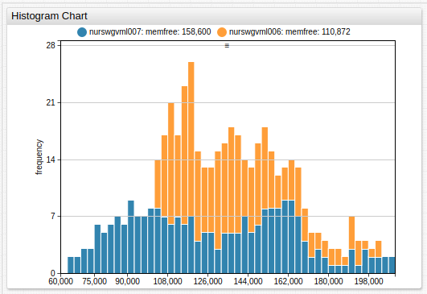

# Histogram Chart

## Overview

The **Histogram Chart** visualizes data distribution.

```ls
[widget]
  type = histogram
  mode = stack
  metric = memfree

  [series]
      entity = nurswgvml00*
```



[](https://apps.axibase.com/chartlab/29223f00)

## Widget Settings

* The settings apply to the `[widget]` section.
* [Shared](../shared/README.md#widget-settings) `[widget]` settings are inherited.

Name | Description | &nbsp;
:--|:--|:--
<a name="mode"></a>[`mode`](#mode)|Histogram display mode.<br>Possible values: `stack` - For multiple series, data is displayed as overlapping bars.<br>**Example**: `mode = stack`.|[↗](https://apps.axibase.com/chartlab/c71a8e3c)
<a name="rotate-ticks"></a>[`rotate-ticks`](#rotate-ticks)| Rotate labels on the time axis by `n` degrees.<br>Possible values: Between `0` (horizontal) and `90` (vertical), or `false` (horizontal).<br>Default value: `0`.<br>**Example**: `rotate-ticks = 45`.|[↗](https://apps.axibase.com/chartlab/4a371589)
<a name="bar-count"></a>[`bar-count`](#bar-count)|Number of bars in which to group or split loaded data.<br>Default value: `50`.<br>**Example**: `bar-count = 20`.|[↗](https://apps.axibase.com/chartlab/41e3f962)|
<a name="left-axis"></a>[`left-axis`](#left-axis)|Value statistics displayed on the left axis.<br>Possible values: `none` - No scaling applied. `density` - Scales the height of the bars such that the sum of their areas is equal to `1`. `fractions` - Scales the height of the bars such that the sum of their heights is equal to `1`. `frequency` - Scales the height of the bars such that the height of each bar is equal to the number of observations in the series. Thus, the sum of the heights is equal to the total number of observations.<br>Default value: `frequency`.<br>**Example**: `left-axis = frequency`.|[↗](https://apps.axibase.com/chartlab/30c87fb2)
<a name="right-axis"></a>[`right-axis`](#right-axis)|Value statistics displayed on the right axis.<br>Possible values: `none` - No scaling applied. `density` - Scales the height of the bars such that the sum of their areas equals `1`. `fractions` - Scales the height of the bars such that the sum of their heights equals `1`. `frequency` - Scales the height of the bars such that each bar height is equal to the number of observations in the series. Thus, the sum of the heights is equal to the total number of observations.<br>Default value: `none`.<br>**Example**: `right-axis = density`.|[↗](https://apps.axibase.com/chartlab/4a85afbd)
<a name="top-axis"></a>[`top-axis`](#top-axis)|Top axis ticks format.<br>Possible values: `none`, `percentiles`, `values`.<br>Default value: `none`.<br>**Example**: `top-axis = percentiles`.|[↗](https://apps.axibase.com/chartlab/1a350178)
<a name="bottom-axis"></a>[`bottom-axis`](#bottom-axis)|Bottom axis ticks format.<br>Possible values: `none`, `percentiles`, `values`.<br>Default value: `values`.<br>**Example**: `bottom-axis = percentiles`.|[↗](https://apps.axibase.com/chartlab/792679fc)
<a name="percentiles"></a>[`percentiles`](#percentiles)|Percentiles displayed when `top-axis` or `bottom-axis = percentiles`.<br>Separate percentiles with commas.<br>Possible values: Between `0` and `100`.<br>**Example**: `percentiles = 1, 10, 50, 90, 99.9`.|[↗](https://apps.axibase.com/chartlab/8abd37b0)
<a name="vertical-grid"></a>[`vertical-grid`](#vertical-grid)|Display a vertical line corresponding to each percentile on the top axis.<br>`vertical-grid` must be used with `top-axis = percentiles` setting.<br>Possible values: `none`, `percentiles`.<br>Default value: `none`.<br>**Example**: `vertical-grid = percentiles`.|[↗](https://apps.axibase.com/chartlab/c30d3895)
<a name="horizontal-grid"></a>[`horizontal-grid`](#horizontal-grid)|Display a horizontal line corresponding to each value on the right or left axis.<br>`horiztonal-grid` setting must be the same as `right-axis` or `left-axis` setting.<br>Possible values: `none`, `density`, `fractions`, `frequency`.<br>Default value: `frequency`.<br>**Example**: `horizontal-grid = frequency`.|[↗](https://apps.axibase.com/chartlab/99d89203)
<a name="range-offset"></a>[`range-offset`](#range-offset)| Offset applied to series range, specified in pixels.<br>Default value: `0`.<br>**Example**:  `range-offset = 100`. | [↗](https://apps.axibase.com/chartlab/34c823a2)

## Examples

### Multiple Series


[](https://apps.axibase.com/chartlab/6f9bf2a8)

### Advanced Configuration Example


[](https://apps.axibase.com/chartlab/bd60b57f)