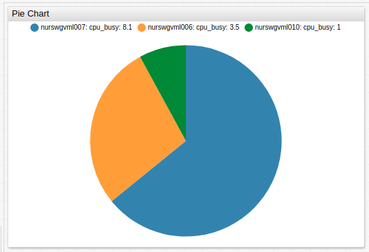
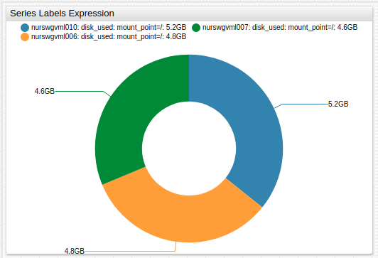
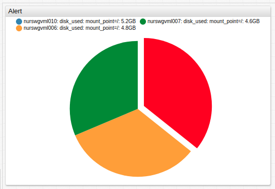
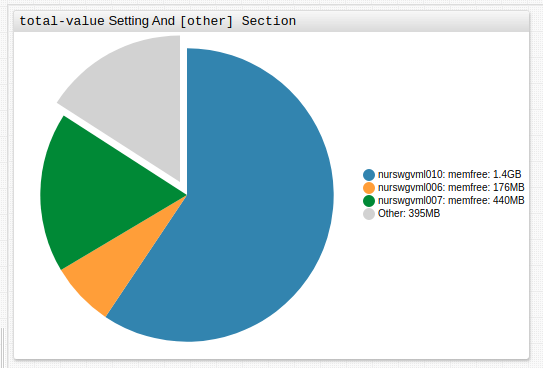
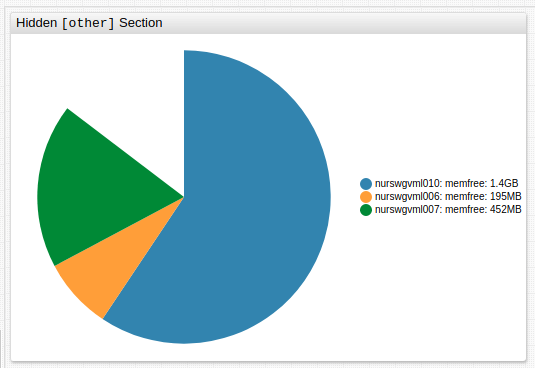

# Pie Chart

## Overview

The **Pie Chart** illustrates numerical proportions between series and total values.

```ls
[widget]
  type = pie

  [series]
    entity = nurswgvml0*
    metric = cpu_busy
```



[](https://apps.axibase.com/chartlab/beb22419)

## Widget Settings

<!-- markdownlint-disable MD102 -->

* The settings apply to the `[widget]` section.
* [Shared](../shared/README.md#widget-settings) `[widget]` settings are inherited.
* The **Pie Chart** includes unique behavior upon clicking a segment of the visualization:
  * Single Click: Opens a dialog window with a [**Time Chart**](../time-chart/README.md) for the series.
  * Double Click: Controlled by `selector-mode`, `on-series-double-click`, and `expand` setting. Default behavior is `expand` upon double click.

Name | Description | &nbsp;
:--|:--|:--
<a name="mode"></a>[`mode`](#mode)|Chart mode.<br>Possible values: `pie`, `ring`.<br>Default value: `pie`.<br>**Example**: `mode = ring`|[↗](https://apps.axibase.com/chartlab/7217e679)
<a name="on-series-double-click"></a>[`on-series-double-click`](#on-series-double-click)|Disable [double click functionality](#widget-settings) in the widget.<br>**Example**: `on-series-double-click = ''`.|[↗](https://apps.axibase.com/chartlab/b18445b6)
<a name="selector-mode"></a>[`selector-mode`](#selector-mode)|Control how series segments react to click interaction.<br>Possible values: `highlight` - Highlights the selected series segment. `expand` - Expands the selected series segment.<br>**Example**: `selector-mode = highlight`.|[↗](https://apps.axibase.com/chartlab/2cfa5cbe)
<a name="total-value"></a>[`total-value`](#total-value)|Specify total value.<br> If no `total-value` setting is specified, total widget value is the sum of all series values.<br>Possible values: Number, `series('alias')`.<br>**Example**: `total-value = 100`.|[↗](https://apps.axibase.com/chartlab/94599517)

<!-- markdownlint-enable MD102 -->

### Icon and Caption Settings

* Apply icons and captions to the **Pie Chart** when `mode = ring`.

Name | Description | &nbsp;
:--|:--|:--
<a name="icon"></a>[`icon`](#icon)|Display `.svg` icon in **Pie Chart** ring.<br>Path to custom icons must be defined.<br>Default ATSD icon directory is `/opt/atsd/atsd/conf/portal/img/`.<br>Reference built-in icons by name, without directory path.<br>See the [Icon Reference Sheet](resources/atsd-embedded-icons.pdf) for built-in icons.<br>**Example**: `icon = public/img/svg/linear/user.svg`.|[↗](https://apps.axibase.com/chartlab/e4f2226b)
<a name="icon-alert-expression"></a>[`icon-alert-expression`](#icon-alert-expression)|Boolean expression to apply conditional CSS style to series icons.<br>CSS style must be specified in the `icon-alert-style` setting.<br>The `value` field refers to the series value.<br>**Example**: `icon-alert-expression = value('s1') > value('s2')`.|[↗](https://apps.axibase.com/chartlab/76b2fa9e)
<a name="icon-alert-style"></a>[`icon-alert-style`](#icon-alert-style)|CSS style applied to the series shape if `icon-alert-expression` returns `true`.<br>**Example**: `icon-alert-style = return alert > 12000 ? 'fill: red' : 'fill:green';`.|[↗](https://apps.axibase.com/chartlab/46f2ce72)
<a name="caption"></a>[`caption`](#caption)|Icon caption.<br>Caption is updated upon series double click.<br>**Example**: `caption = Administrative Users`.|[↗](https://apps.axibase.com/chartlab/a31585b7)
<a name="caption-style"></a>[`caption-style`](#caption-style)|Caption CSS style.<br>Caption style is updated upon series double click.<br>**Example**: `caption-style = font-size: 64px; font-weight: bold; fill: steelblue;`.|[↗](https://apps.axibase.com/chartlab/ecbac33b)
<a name="min-font-size"></a>[`min-font-size`](#min-font-size)|Minimum caption font size.<br>Font size does not scale below specified size.<br>**Example**: `min-font-size = 24`.|[↗](https://apps.axibase.com/chartlab/7704bb89)
<a name="max-font-size"></a>[`max-font-size`](#max-font-size)|Maximum caption font size.<br>Font size does not scale above specified size.<br>**Example**: `max-font-size = 8`.|[↗](https://apps.axibase.com/chartlab/7704bb89)

## Series Settings

* The settings apply to the `[series]` section.
* [Shared](../shared/README.md#series-settings) `[series]` settings are inherited.

Name | Description | &nbsp;
:--|:--|:--
<a name="expand"></a>[`expand`](#expand)|Expand series segment.<br>Expand all series segments when setting specified in the `[series]` section.<br>Possible value: `false`, `true`.<br>Default value: `false`.<br>**Example**: `expand = true`.|[↗](https://apps.axibase.com/chartlab/f5684bc4)|
<a name="series-labels"></a>[`series-labels`](#series-labels)|Value label location.<br>Set as an [expression](https://axibase.com/docs/atsd/administration/metric-persistence-filter.html#expression-syntax) which changes the label type based on series value.<br>Possible settings: `inside`, `outside`, `connected`, `auto`, `none`.<br>Default value: `none`.<br>**Example**: `series-labels = inside`.|[↗](https://apps.axibase.com/chartlab/75107b6b)|

### Other Settings

* The settings apply to the `[other]` section.
* Specifying the `[other]` section creates an addition segment not associated with any series which displays a value or spare capacity.

Name | Description | &nbsp;
:--|:--|:--
|<a name="display"></a>[`display`](#display)|Display the difference between `total-value` and sum of visible series values.<br>Possible values: `false`, `true`.<br>Default: `true`.<br>**Example**: `display = false`|[↗](https://apps.axibase.com/chartlab/03201f9e)|
<a name="label"></a>[`label`](#label)|`[other]` section label.<br>Default: `Other`.<br>**Example**: `label = Unmonitored Memory`|[↗](https://apps.axibase.com/chartlab/064091fa)|
<a name="tooltip"></a>[`tooltip`](#tooltip)|`[other]` section tooltip displayed upon mouseover.<br>Default: `Other`.<br>**Example**: `tooltip = Unmonitored memory (HMC disabled)`.|[↗](https://apps.axibase.com/chartlab/03be3f7d)|
<a name="color"></a>[`color`](#color)|`[other]` section color.<br>Default: `lightgray`.<br>**Example**: `color = black`.|[↗](https://apps.axibase.com/chartlab/db9f4d31)|

## Examples

### Ring Icons and Captions


[](https://apps.axibase.com/chartlab/e31d60be)

### Series Labels Expression



[](https://apps.axibase.com/chartlab/7f7a1bc3)

### Alert



[](https://apps.axibase.com/chartlab/f1cd6467)

### `total-value` Setting and `[other]` Section



[](https://apps.axibase.com/chartlab/db7dd568)

### Hidden `[other]` Section



[](https://apps.axibase.com/chartlab/f0e7d218)