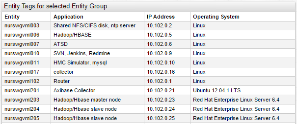

# Property Table


## Overview

The Property Table Widget displays properties collected for the entity in tabular format.

## Syntax

Property Tables support both [Shared Widget](../shared/README.md) and Shared Table Syntax.

### `[widget]` Settings

By default, Property Table contains `entity` and `time` columns.

Setting|Syntax|Description|Example
--|--|--|--
|Case|`case = upper`|Define case for column headers.<br>Possible values: `lower`, `upper`|
|Join|`join = true`|Performs join by `entity` and `type`.<br>`join = entity` performs join by `entity` only.<br>Possible values: `true`, `false`, `entity`.<br>Default value: `false`|[](https://apps.axibase.com/chartlab/598f44f3/6/)|
|Expand Tags|`expand-tags = true`|Show response tags as columns.<br>Useful when exact tags are not known in advance.|[](https://apps.axibase.com/chartlab/d7470e6c/2/)|
|Hide Column|`hide-column = value <= 0 |column.key.indexOf('paging') == 0`|Expression based setting.<br>Hide particular columns if all cell values in a column satisfy the condition or if column name matches the pattern.|[](https://apps.axibase.com/chartlab/d7470e6c)|

Columns created when multiple types are joined into one table, can be hidden using both the full name and the short name:

```ls
# hide all time columns
column-time = null

# hide time columns for specific types
column-cpu.time = null
column-disk.time = null
```

### `[column]` Settings

Setting|Syntax|Description|Example
--|--|--|--
|Key|`key = iface`|Name of property in JSON that is received from the server.|[](https://apps.axibase.com/chartlab/681f535a/6/)|
|Tag|`tag = addr`|Tag name.|[](https://apps.axibase.com/chartlab/681f535a/7/)|
|Value|`value = row.tags.addr`|Receive any value which can be written into the property table via JSON.<br>Supported arguments: `this`, `value`, `alert`, `row`, `column`, `widget`, `el`, `rowEl`, `td`, `filter`, `dialog`, `series`.|[](https://apps.axibase.com/chartlab/681f535a/8/)|
|Format|`format = isoformat = jsonformat = bytes`|Formats cellusing the specified [formatting functions](../../syntax/formatting-settings.md).|[](https://apps.axibase.com/chartlab/511b2c80/2/)|
|Number Format|`format-numbers = false`|Disable number formatting.|[](https://apps.axibase.com/chartlab/1309a5ab)|
|Header Format|`format-headers=true`|Disable column name formatting.|[](https://apps.axibase.com/chartlab/99717743/3/)|

### `[property]` Settings

Setting|Syntax|Description
--|--|--
|Type|`type = nmon.command`|Property type.<br>Use `$entity_tags` to retrieve entity tags.|
|Keys|`[keys]queue = qm1.to.qm3`|One or multiple keys specified as `name = value` pairs under `[keys]` settings.|
|Exact Match|`exactMatch = true`|Exact match selects a record with exactly the same key as requested in `[keys]` settings.<br>Default: `false`.<br>Partial match selects records with key that contains requested fields but can also include other fields.|
|Key Tag Expression|`keys.manager = 'MGR01' AND tags.queue LIKE 'qm1.*'`|Expression for matching properties with specified keys and tags.<br>Keys are accessed with `keys.{key-name}` and tags with `tags.{tag-name}`.|
|Limit|`limit = 10`|Maximum number of returned records.|
|Last|`last = true`|Return only records with the update time equal to the maximum update time of matched records.<br>Default: `false`.|
|Offset|`offset = 5000`|Difference, in milliseconds, between maximum update time of matched records and update time of the current record.<br>If the difference exceeds `offset`, the record is excluded from results.|
Tag Offset|`tag-offset = 15000`|Difference, in milliseconds, between update time of the current record and update time of the tag field.<br>If the difference exceeds `tag-offset`, the tag field is excluded from tags object.|

## Examples

### Entity Tags for Entity Group

```ls
[property]
  type = $entity_tags
  entityGroup = nur-collectors
```



[](https://apps.axibase.com/chartlab/013e6026/6/)

### Entity Tags

```ls
[property]
  type = $entity_tags
  entity = nurswgvml00?
```


[](https://apps.axibase.com/chartlab/013e6026/6/)

### Default Style


[](https://apps.axibase.com/chartlab/0e9e5ca1)

### Unix Style

```ls
class = terminal
```


[](https://apps.axibase.com/chartlab/0e9e5ca1/2/)