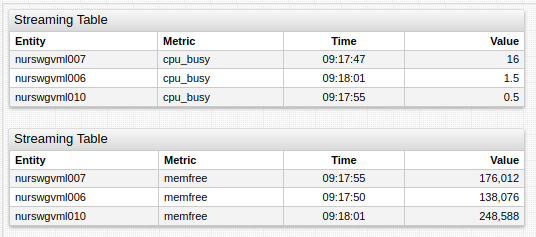
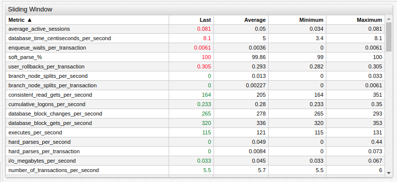
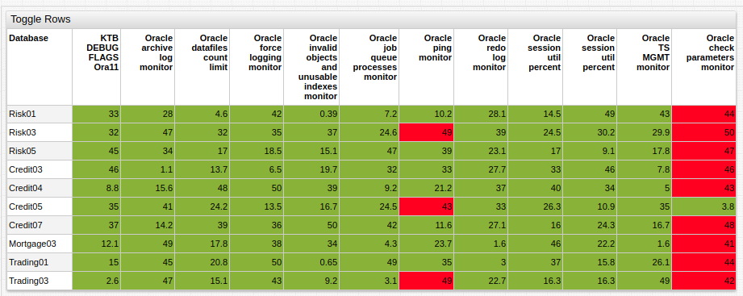

# Series Table

## Overview

The **Series Table** displays last series values.

```ls
[widget]
  type = table
  metric = cpu_busy

  [series]
    entity = nurswgvml0*
```



[](https://apps.axibase.com/chartlab/7c05786f)

## Widget Settings

* The settings apply to the `[widget]` section.
* [Common](../shared/README.md#widget-settings) `[widget]` settings are inherited.
* [Common Table](../shared-table/README.md#widget-settings) `[widget]` settings are inherited.

Name | Description | &nbsp;
:--|:--|:--
<a name="merge-columns"></a>[`merge-columns`](#merge-columns)| Merge multiple series into a single row using a boolean expression or enumerated columns as a grouping key.<br>**Example**: <ul><li>`merge-columns = entity`</li><li>`merge-columns = entity, tags`</li><li>`merge-columns = tags.target`</li><li>`merge-columns = a.tags.country == b.tags.country`</li></ul>| [↗](https://apps.axibase.com/chartlab/6489829c/25/)<br>[↗](https://apps.axibase.com/chartlab/a6853bd2/2/)<br>[↗](https://apps.axibase.com/chartlab/42a161bc/4/)|
<a name="hide-empty-series"></a>[`hide-empty-series`](#hide-empty-series)| Hide series for which no data exists or data whose validity is expired.<br>Possible values: `false`, `true`.<br>Default value: `true`.<br>**Example**: `hide-empty-series = false`| [↗](https://apps.axibase.com/chartlab/cfc5c1bd)

## Series Settings

* The settings apply to the `[series]` section.
* [Common](../shared/README.md#series-settings) `[series]` settings are inherited.

Name | Description | &nbsp;
:--|:--|:--
<a name="key"></a>[`key`](#key)| **a.** Identifier to associate field of [`row`](#row-object) object to a column.<br> **b.** Client [aggregation](../../configuration/aggregators.md#server-and-client-aggregators) function. Default period `1 hour` is used. Also, refer to [Server Aggregation](#server-aggregation).<br>**Examples**:<br>`key = alias`<br>`key = avg`| [↗](https://apps.axibase.com/chartlab/7c05786f/6/)<br>[↗](https://apps.axibase.com/chartlab/7c05786f/7/)
<a name="series-value"></a>[`series-value`](#series-value) | JavaScript expression to calculate derived column value.<br>**Example**: `series-value = min()` | [↗](https://apps.axibase.com/chartlab/b0a45b83/2/ )

### Rows Representation

Table row is represented by `row` object, fields of which depend on [`merge-columns`](#merge-columns) setting.

#### `merge-columns` is specified

`row` object fields:

* `aliases`: **object** - `{alias: series}`, object with `key:value` pairs, where keys are series [`aliases`](../shared/README.md#alias), and values are corresponding series objects, which fields are described [below](#no-merge-columns)
* `map`: **object** - similar to `aliases`, but the `key` depends on `merge-columns` value:

    `merge-columns`| Key| `map` object|&nbsp;
    ---|:---:|---|---|
    `entity`|Metric name| `{metric_name:series}`|[↗](https://apps.axibase.com/chartlab/ff8aabfd/6/)
    `metric`|Entity name| `{entity_name:series}`|[↗](https://apps.axibase.com/chartlab/ff8aabfd/5/)
    Other value|-|`{}`|-

:::warning
`aliases` and `map` cannot be used simultaneously: if `[series]` contains `alias` it is not added to `map`.
:::

#### no `merge-columns`

Each table row matches one series with unique **`entity+metric+series tags`** combination.

`row` object fields:

* `alias`: **string** - series [`alias`](../shared/README.md#alias)
* `config`: **object** - parsed portal config
* `data`: **object** - `{t:[], v:[]}`, timestamps and corresponding values
* `last`: **object** - `{t:<integer>, v:<number>}`, last timestamp and corresponding value
* `lastIntv`: **array** - array of last two timestamps

## Examples

* [Minimum and Maximum Value Time](#minimum-and-maximum-value-time)
* [Multiple Offsets](#multiple-offsets)
* [Sliding Window](#sliding-window)
* [Color Grid](#color-grid)
* [Multiple Intervals](#multiple-intervals)
* [Alert Styles](#alert-styles)
* [Toggle Rows](#toggle-rows)
* [Calculated Columns](#calculated-columns)
* [Multiple Metrics](#multiple-metrics)
* [Multiple Tags](#multiple-tags)
* [Metadata Columns](#metadata-columns)
* [Configuration Columns](#configuration-columns)
* [Server Aggregation](#server-aggregation)

### Minimum and Maximum Value Time


[](https://apps.axibase.com/chartlab/905f49d0)

### Multiple Offsets


[](https://apps.axibase.com/chartlab/7c463fac)

### Sliding Window



[](https://apps.axibase.com/chartlab/b09687f9)

### Color Grid


[](https://apps.axibase.com/chartlab/6489829c/8/)

### Multiple Intervals


[](https://apps.axibase.com/chartlab/b371626f/2/)

### Alert Styles


[](https://apps.axibase.com/chartlab/4d03229c)

### Toggle Rows



[](https://apps.axibase.com/chartlab/ae3ece3f)

### Calculated Columns


[](https://apps.axibase.com/chartlab/ff8aabfd)

### Multiple Metrics


[](https://apps.axibase.com/chartlab/ca71ab6d)

### Multiple Tags


[](https://apps.axibase.com/chartlab/c9e3624d)

### Metadata Columns


[](https://apps.axibase.com/chartlab/f804ddc9)

### Configuration Columns


[](https://apps.axibase.com/chartlab/fb8bdf13/4/)

### Server Aggregation


[](https://apps.axibase.com/chartlab/ff8aabfd/8/)