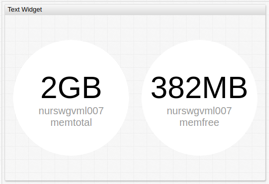
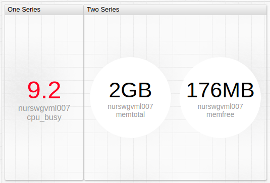
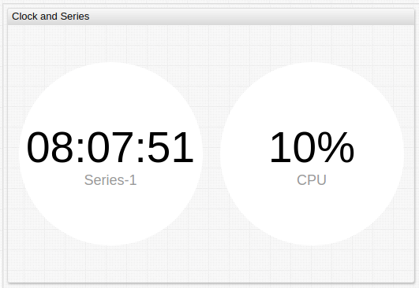
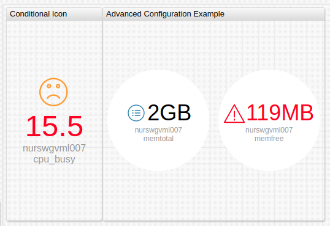
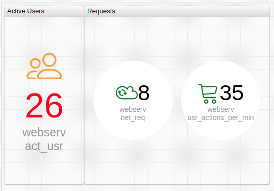

# Text Widget

## Overview

The **Text Widget** displays series last insert value in a text-based interface.

```ls
[widget]
  type = text
  entity = nurswgvml007

  [series]
    metric = memtotal
  [series]
    metric = memfree
```



[](https://apps.axibase.com/chartlab/6dc64b91)

## Widget Settings

* The settings apply to the `[widget]` section.
* [Shared](../shared/README.md#widget-settings) `[widget]` settings are inherited.

Name|Description|&nbsp;
:--|:--|:--
<a name="circle"></a>[`circle`](#circle)|Display series values inside a circle.<br>Possible values: `false`, `true`.<br>Default value: `false`.<br>**Example**: `circle = true`.|[↗](https://apps.axibase.com/chartlab/0df9d810)
<a name="min-font-size"></a>[`min-font-size`](#min-font-size)|Minimum font size for labels, in pixels.<br>**Example**: `min-font-size = 20`.|[↗](https://apps.axibase.com/chartlab/48d4862e)
<a name="max-font-size"></a>[`max-font-size`](#max-font-size)|Maximum font size for labels, in pixels.<br>**Example**: `max-font-size = 60`.|[↗](https://apps.axibase.com/chartlab/dac1b3f1)
<a name="on-series-click"></a>[`on-series-click`](#on-series-click)|Behavior upon series label click.<br>See example configuration for possible values.<br>**Example**: `on-series-click = callDialog({ type: 'page', url: 'https://axibase.com/docs/atsd/' })`.|[↗](https://apps.axibase.com/chartlab/0108c090)
<a name="icon-size"></a>[`icon-size`](#icon-size)|Resize icon to fill all available space.<br>If `icon-size` is not set, icon is scaled proportionally to font height.<br>Control font size with [`min-font-size`](#min-font-size) and [`max-font-size`](#max-font-size).<br>Possible value: `auto`.<br>**Example**: `icon-size = auto`. |[↗](https://apps.axibase.com/chartlab/a4d3f316)

### Series Settings

* The settings apply to the `[series]` section.
* [Shared](../shared/README.md#series-settings) `[series]` settings are inherited.

Name|Description|&nbsp;
:--|:--|:--
<a name="icon"></a>[`icon`](#icon)|Display `.svg` icon in the **Text Widget**.<br>Path to custom icons must be defined.<br>Default ATSD icon directory is `/opt/atsd/atsd/conf/portal/img/`.<br>Reference built-in icons by name, without directory path.<br>See the [Icon Reference Sheet](../pie-chart/resources/atsd-embedded-icons.pdf) for built-in icons.<br>Underscore ( `_` ) can be replaced with dash (`-`).<br>Custom icon must be placed in `/atsd-hostname/config/workspace/svg` and referenced with the path `/workspace/svg/image-name.svg`.<br>**Example**: `icon = public/img/svg/linear/user.svg`.|[↗](https://apps.axibase.com/chartlab/e8c70b2e)
<a name="icon-position"></a>[`icon-position`](#icon-position)|Icon position relative to series value.<br>Possible values: `left`, `right`, `top`, `bottom`.<br>Default value: `top`.<br>**Example**: `icon-position = bottom`.|[↗](https://apps.axibase.com/chartlab/a81127d4)|
<a name="icon-color"></a>[`icon-color`](#icon-color)|Icon color.<br>Possible values: [color name](https://en.wikipedia.org/wiki/Web_colors).<br>**Example**: `icon-color = orange`.|[↗](https://apps.axibase.com/chartlab/a7edfac4)|
<a name="icon-alert-style"></a>[`icon-alert-style`](#icon-alert-style)|CSS style applied to icon when [`alert-expression`](../shared/README.md#alert-expression) is `true`.<br>**Example**: `icon-alert-style = fill: red;`.|[↗](https://apps.axibase.com/chartlab/91e76758)|

## Examples

### Multiple Series



[](https://apps.axibase.com/chartlab/573460c7)

### Clock and Series



[](https://apps.axibase.com/chartlab/b20f631f)

### Advanced Configuration Example



[](https://apps.axibase.com/chartlab/61fd6d23)

### Icon Alert



[](https://apps.axibase.com/chartlab/1bfb6339)