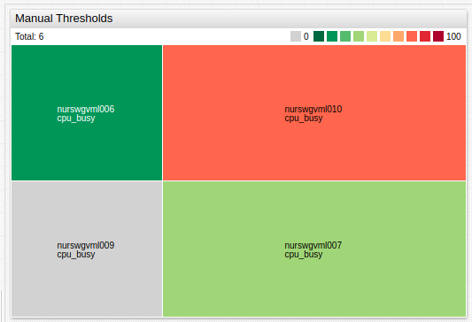
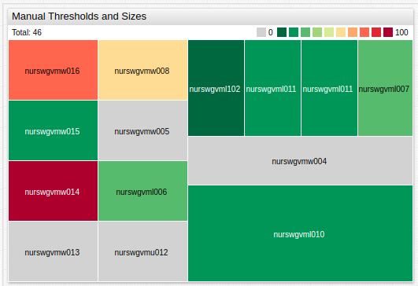

# Treemap Widget

## Overview

The **Treemap Widget** displays each series as a colored rectangle according to the magnitude of series value deviation from the threshold.

```ls
[widget]
  type = treemap
  timespan = 1 hour
  entity = nurswgvml007

  [series]
    metric = cpu_busy
  [series]
    metric = memfree
```


[](https://apps.axibase.com/chartlab/13b769a4)

## Widget Settings

* The settings apply to the `[widget]` section.
* [Shared](../shared/README.md#widget-settings) `[widget]` settings are inherited.

Name | Example | Description | &nbsp;
:--|:--|:--|:--
<a name="display-total"></a>[`display-total`](#display-total) |`display-total = false` |Display the sum of rectangle sizes in widget header<br>Boolean expression.<br>Default value: `true`. |[↗](https://apps.axibase.com/chartlab/8b6c610b)
<a name="size-name"></a>[`size-name`](#size-name) |`size-name = Value` |Specify secondary title if `display-total = true`.<br>`size-name` value appended to default title `Total`. |[↗](https://apps.axibase.com/chartlab/b6f22079)
<a name="format-size"></a>[`format-size`](#format-size) |`format-size = kilobytes` |Format `size` setting values.<br>Refer to [Format Settings](../../syntax/format-settings.md) for possible values. |[↗](https://apps.axibase.com/chartlab/fa892920) |
<a name="font-size"></a>[`font-size`](#font-size) |`font-size = 15` |Universal font size in integer value.<br>All widget text, except `title` are affected.<br>Default value: `10`. |[↗](https://apps.axibase.com/chartlab/afef0605)
<a name="colors"></a>[`colors`](#colors) | `colors = green, yellow,red` | Color of each threshold range.<br>Each color is assigned to a threshold range.<br>If there are more colors than threshold ranges, additional colors are assigned to the lowest threshold range first.<br>Possible values: [color name](https://en.wikipedia.org/wiki/Web_colors).| [↗](https://apps.axibase.com/chartlab/eede9096)
<a name="color-range"></a>[`color-range`](#color-range) |`color-range = blue` |Widget color range.<br>Possible values: `red`, `blue`, `black`. <br>Default value: `red`. |[↗](https://apps.axibase.com/chartlab/f79edb4c)
<a name="gradient-count"></a>[`gradient-count`](#gradient-count) |`gradient-count = 2` |Number of gradients in each range. |[↗](https://apps.axibase.com/chartlab/aeeffb8f/16/)
<a name="total-size"></a>[`total-size`](#total-size) |`total-size = 70` |Maximum size of all rectangles combined.<br>If `total-size` is greater than combined size of all rectangles, additional space is filled `white`.|[↗](https://apps.axibase.com/chartlab/6542dddf)
<a name="palette-ticks"></a>[`palette-ticks`](#palette-ticks) | `palette-ticks = true` | Display legend labels on mouseover.<br>Boolean expression.<br>Default Value: `false`. | [↗](https://apps.axibase.com/chartlab/07fb9bac)
<a name="rotate-palette-ticks"></a>[`rotate-palette-ticks`](#rotate-palette-ticks) | `rotate-palette-ticks = true` | Rotate legend labels.<br>Boolean expression<br>`true` rotates ticks to vertical.<br>Default value: `false`.| [↗](https://apps.axibase.com/chartlab/1401481e)
<a name="range-merge"></a>[`range-merge`](#range-merge) | `range-merge = true` | Compute a single range for all series with minimum and maximum from all loaded series.<br>Boolean expression.<br>Default value: `false`. | [↗](https://apps.axibase.com/chartlab/b28955af)
<a name="mode"></a>[`mode`](#mode) |`mode = row` |Specifiy widget layout.<br>Possible values: `default`, `row`: Align rectangles as rows, `column`: Align rectangles as columns, `auto`: Switch between row and column modes depending on widget size.<br>Default value: `default`. |[↗](https://apps.axibase.com/chartlab/11f02c30)

## Series Settings

* The settings apply to the `[series]` section.
* [Shared](../shared/README.md#series-settings) `[series]` settings are inherited.

Name | Example | Description | &nbsp;
:--|:--|:--|:--
<a name="size"></a>[`size`](#size)|`size = 3`<br>`size = value`|Relative rectangle size.<br>Possible values: Number, `value`, `value('alias')`.<br>Default value: `1`.|[↗](https://apps.axibase.com/chartlab/76515697e)
<a name="thresholds"></a>[`thresholds`](#thresholds) | `thresholds = 0, 25, 50, 75, 100` | Threshold values by which series values are assigned colors.| [↗](https://apps.axibase.com/chartlab/9777258c)
<a name="label"></a>[`label`](#label) | `label = Total Capacity`| Rectangle label.<br>Default value: `entity-metric`. |[↗](https://apps.axibase.com/chartlab/1d1ec7aa)

### Other Settings

* The settings apply to the `[other]` section.
* Specifying the `[other]` section creates an additional rectangle not associated with any series which displays a value or spare capacity.

Name | Example | Description | &nbsp;
:--|:--|:--|:--
<a name="size"></a>[`size`](#size)|`size = 3`<br>`size = value`|Relative rectangle size.<br>Possible values: Number, `value`, `value('alias')`.<br>Default value: `1`.|[↗](https://apps.axibase.com/chartlab/529700a6)
<a name="label"></a>[`label`](#label) | `label = Total Capacity`| Rectangle label.<br>Default value: `Size`. |[↗](https://apps.axibase.com/chartlab/9777258c)
`color` | `color = black`| Color applied to `[other]` section.<br>Default value: `grey`.|[↗](https://apps.axibase.com/chartlab/c06aabd2)

### Properties Settings

* The settings apply to the `[properties]` section.
* In `[series]` or `[other]` section, define properties displayed on mouseover.
* If a value contains `=` or `\`, escape the characters, for example `\=` or `\\`, respectively.

```ls
/* Define Series Tooltip */
[properties]
  Data Center = Cuperito
  Site = California
  Function = SAP DB
```


[](https://apps.axibase.com/chartlab/b686fb79)

## Examples

### Manual Thresholds



[](https://apps.axibase.com/chartlab/9adaf9a0)

### Advanced Configuration Example



[](https://apps.axibase.com/chartlab/3bedad3f)